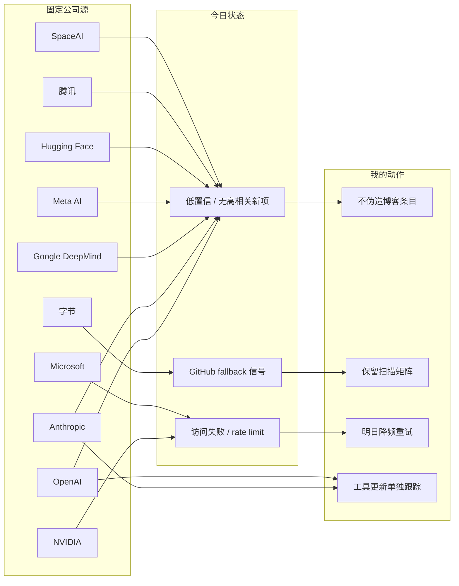

# 公司来源扫描矩阵 - 2026-07-04

> 类型：大厂资讯 / 工程博客 / Research 扫描矩阵  
> 返回日报：[[Daily/2026-07-04]]

## 一句话结论

今日未确认 OpenAI、Anthropic、DeepMind、Meta、NVIDIA、Microsoft、Hugging Face、腾讯、字节、SpaceAI 的强相关新博客/论文；可行动信号主要来自 coding 工具 release，且 GitHub / arXiv 均有 rate limit。

## 公司来源扫描矩阵

| 公司/实验室 | 来源/栏目 | 今日状态 | 高相关条数 | 代表条目 | 备注 |
|---|---|---|---:|---|---|
| OpenAI | News / Research | 低置信 / 无高相关新项 | 0 | 无 | Codex 在工具矩阵单独跟踪；未确认今日强相关 blog/research。 |
| Anthropic | News / Research / Engineering | 低置信 / 工具相关观察 | 0 | Claude Code watch | Claude Code release notes 继续观察 Claude Tag、permissions、context、remote execution。 |
| Google DeepMind | Blog / Research | 低置信 / 无高相关新项 | 0 | 无 | 未确认今日 AI Infra/RL 强相关单篇。 |
| Meta AI | Blog / Research | 低置信 / 无高相关新项 | 0 | 无 | 未确认今日强相关工程文章。 |
| NVIDIA | Technical Blog / AI | 访问失败 / 低置信 | 0 | 无 | 配置分类页历史上有访问不稳定；需改 RSS 或站内搜索。 |
| Microsoft | Research AI | 访问失败 / 低置信 | 0 | 无 | 页面历史上 403；未确认今日新项。 |
| Hugging Face | Blog / Papers / Releases | 低置信 / 无高相关新项 | 0 | 无 | 今日未确认强相关新项；继续观察 inference / transformers / eval。 |
| 腾讯 | AI Lab / 技术博客 | 低置信 / 无高相关新项 | 0 | 无 | 保留固定扫描位。 |
| 字节 | Seed / 技术博客 / GitHub | 间接高相关 / fallback | 1 | DeerFlow | 使用 2026-06-30 broad snapshot fallback；非今日新增。 |
| SpaceAI | Blog / News | 低置信 / 弱相关 | 0 | 无 | 主线弱相关。 |

## 大厂信号图

## 可信度与局限性

- `blogwatcher-cli` 当前环境不可用，无法用本地 RSS DB 补充公司博客。
- 多个官方站点历史上有 403/404/动态渲染问题，本矩阵采用透明低置信标注。
- 今日保留大厂固定矩阵，避免把“无可验证新项”误写成“未扫描”。

## 相关链接

- [[Industry/Tools/2026-07-04/coding-tools-update-matrix]]
- [[GitHub/2026-07-04/github-snapshot-top10]]
- [[Daily/2026-07-04]]

## 标签

#ai-radar #company-scan #engineering-blog #research
