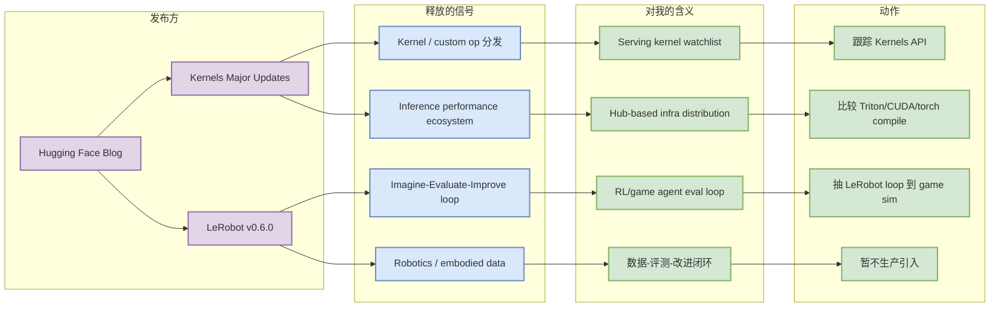

# Hugging Face: Kernels Major Updates 与 LeRobot v0.6.0

> 日期：2026-07-07  
> 发布方/大厂：Hugging Face  
> 栏目/来源类型：Blog / Product-Engineering Update  
> 原文：https://huggingface.co/blog/revamped-kernels / https://huggingface.co/blog/lerobot-release-v060

## 一句话结论

Hugging Face 今天同时出现 Kernels 与 LeRobot 更新信号：一个偏推理/算子生态，一个偏 embodied/RL 数据闭环，分别对应 AI Infra 和 RL/Game AI 的可落地方向。

## TL;DR

- `🤗 Kernels: Major Updates` 发布于 2026-07-06，属于 inference / custom kernels / Hub 分发方向。
- `LeRobot v0.6.0: Imagine, Evaluate, Improve` 发布于 2026-07-07，偏 robotics data/eval/improvement loop。
- 对用户：Kernels 关注 serving 侧算子和部署；LeRobot 关注 RL/robotics 的 data-eval-improve loop，可迁移到 game agent 训练闭环。

## 元信息

| 字段 | 内容 |
|---|---|
| 发布方 | Hugging Face |
| 栏目/来源类型 | Blog / Engineering / Product Update |
| 发布时间 | 2026-07-06 / 2026-07-07 |
| 代表条目 | Kernels Major Updates；LeRobot v0.6.0 |
| 原文链接 | https://huggingface.co/blog/revamped-kernels；https://huggingface.co/blog/lerobot-release-v060 |

## 信息压缩图示

## 专业解读

Kernels 方向值得 AI Infra 工程师关注，因为 Hugging Face 正在把模型生态、Hub 分发和性能 kernel 连接起来。LeRobot 则体现 “imagine, evaluate, improve” 这类闭环范式，虽然偏 robotics，但对 RL 游戏模型训练同样重要：环境、数据、评测、改进要闭环，而不是只训练 policy。

## 通俗解释

一个更新在说“怎么让模型底层算得更快、更好分发”，另一个更新在说“机器人/智能体怎么用评测结果反过来改进自己”。

## 对我的影响

- Kernels：加入 serving kernel watchlist，观察是否能替代或补充 Triton/CUDA 自定义算子分发。
- LeRobot：抽象成 game AI 的 data/eval/improve loop，用于 Point Rummy / RL 环境构建。
- 暂不直接引入生产；先读 API、benchmark 和依赖边界。

## 可信度与局限性

- 可信度：高，来自 Hugging Face 官方博客。
- 局限：需要进一步读正文确认具体功能和兼容性；当前日报只做高层信号解读。

## 我应该如何跟进

1. 阅读 Kernels 更新，记录支持的 kernel 类型和部署路径。
2. 阅读 LeRobot v0.6.0，抽取 evaluate/improve loop。
3. 将 LeRobot loop 映射到 Rummy sim/evaluator/bot improvement。

## 相关链接

- Hugging Face Kernels：https://huggingface.co/blog/revamped-kernels
- LeRobot v0.6.0：https://huggingface.co/blog/lerobot-release-v060

#ai-radar #industry #huggingface #kernels #lerobot #ai-infra #rl
