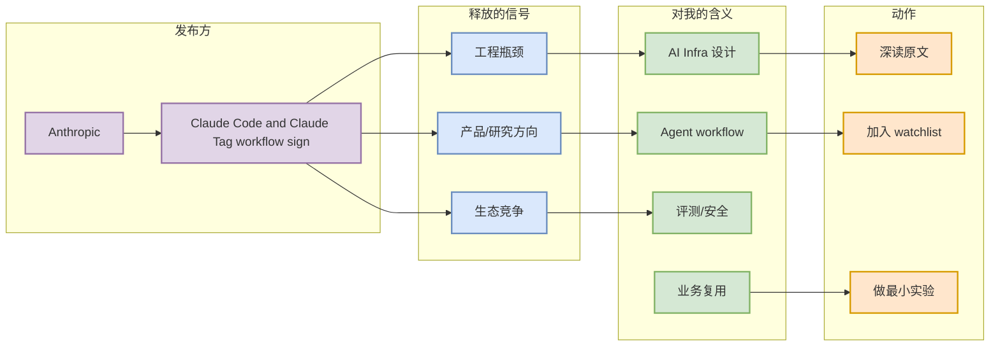

# Claude Code and Claude Tag workflow signals

> 日期：2026-07-09
> 发布方/大厂：Anthropic
> 栏目/来源类型：News / Changelog / Product Announcement
> 原文：https://docs.anthropic.com/en/release-notes/claude-code

## 一句话结论
Claude Code 仍是 terminal-first coding agent 的核心信号，Claude Tag 代表团队协作入口。

## TL;DR
- 核心信号：Claude Code 仍是 terminal-first coding agent 的核心信号，Claude Tag 代表团队协作入口。
- 对 AI Infra / LLM / Agent 的影响：需要持续跟踪权限模式、上下文组织、远程执行和多 agent 监控。
- 建议：加入观察列表，优先看是否影响 serving、agent loop、权限和评测。

## 元信息
| 字段 | 值 |
|---|---|
| 发布方 | Anthropic |
| 来源类型 | News / Changelog / Product Announcement |
| 发布时间 | 2026-07-09 扫描 |
| 原文 | [link](https://docs.anthropic.com/en/release-notes/claude-code) |
| 可信度 | 中：来源页可定位，但 cron 未做全文抽取 |

## 信息压缩图示

## 影响矩阵
| 维度 | 判断 | 跟进动作 |
|---|---|---|
| 工程价值 | 需要持续跟踪权限模式、上下文组织、远程执行和多 agent 监控。 | 看原文和相关代码/发布说明 |
| 落地难度 | 中 | 先做小规模实验 |
| 风险 | 中 | 等待更多 release notes / benchmark |

## 专业解读
需要持续跟踪权限模式、上下文组织、远程执行和多 agent 监控。 这类信号对用户最重要的不是新闻本身，而是它是否改变训练、推理、agent 编排或代码工作流的默认假设。

## 通俗解释
可以把它看成一个“方向指示牌”：大厂把注意力放到哪里，后续开源工具、论文 benchmark 和工程实践往往会跟进。

## 关键机制拆解
- 输入：公司博客、release notes 或产品公告。
- 机制：把产品功能映射到 infra / agent / eval 能力。
- 输出：今天是否需要深读、试用或只观察。

## 对我的影响
需要持续跟踪权限模式、上下文组织、远程执行和多 agent 监控。

## 可信度与局限性
- 来源可信，但自动扫描可能漏掉页面内细节。
- 今日以高相关主题过滤，不代表该公司没有其他发布。

## 我应该如何跟进
1. 打开原文，确认发布时间和具体功能。
2. 如果涉及工具或 infra，建立最小复现实验。
3. 将可复用点沉淀到 coding-agent / serving watchlist。

## 相关链接
- [原文](https://docs.anthropic.com/en/release-notes/claude-code)

#ai-radar #industry #anthropic
