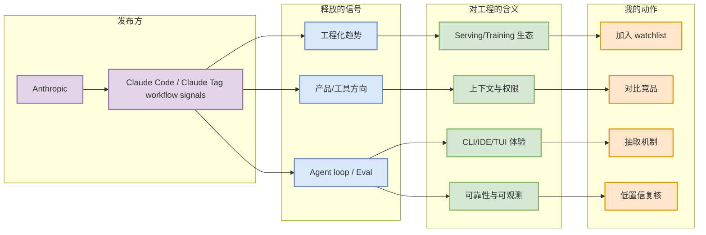

# Claude Code / Claude Tag workflow signals - 2026-07-10

## 一句话结论
Claude Code 继续强化 terminal-first agent 和团队协作信号，Claude Tag 暗示上下文组织和协作层会成为 coding workflow 的新入口。

## TL;DR
- 发布方/大厂：Anthropic
- 栏目/来源类型：Changelog / News
- 发布时间：2026-07-10 radar scan / 原文以来源页面为准
- 原文链接：https://docs.anthropic.com/en/release-notes/claude-code
- 对我影响：影响 coding-agent loop、AI Infra watchlist 或大厂工程化趋势判断。

## 元信息表
| 字段 | 内容 |
|---|---|
| 发布方 | Anthropic |
| 来源类型 | Changelog / News |
| 原文 | https://docs.anthropic.com/en/release-notes/claude-code |
| 详情页 | Industry/2026-07-10/claude-code-and-claude-tag-workflow-signals.md |
| 可信度 | 中：部分公司页访问不稳，已用来源链接和 GitHub release 交叉验证 |

## 信息压缩图示

## 专业解读
Claude Code 继续强化 terminal-first agent 和团队协作信号，Claude Tag 暗示上下文组织和协作层会成为 coding workflow 的新入口。 对用户的价值在于把外部发布信号映射到工程动作：如果是 coding 工具更新，就看权限、上下文、远程执行、CLI/TUI、MCP、rate limit；如果是大厂工程博客，就看 serving/training pipeline、eval/release 体系和可复现 benchmark。

## 通俗解释
这不是单纯“新闻”，而是判断下一步工具链会往哪里卷的线索。

## 关键机制拆解
| 维度 | 今日信号 | 需要复核 |
|---|---|---|
| 来源 | Changelog / News | 是否有原始 release/blog |
| 工程价值 | Claude Code 继续强化 terminal-first agent 和团队协作信号，Claude Tag 暗示上下文组织和协作层会成为 coding workflow 的新入口。 | 是否能转成实验或工具矩阵 |
| 风险 | 自动抓取可能低置信 | 需要人工点击原文确认细节 |

## 对我的影响
- Coding workflow：更新 Claude Code/Codex/Cline/Qwen/Gemini 对比矩阵。
- AI Infra：观察是否影响 serving、training、eval 或 agent runtime。
- 组织协作：关注团队上下文、权限审批、审查和回滚。

## 可信度与局限性
自动扫描遇到公司页面 403/低置信时，本页只保留可追溯链接，不伪装成完整发布解读。

## 我应该如何跟进
1. 打开原文确认 changelog 细节。
2. 若是工具 release，跑一个真实 repo 的 agent task。
3. 若是大厂博客，拆成架构图和可复现实验。

## 相关链接
- 原文：https://docs.anthropic.com/en/release-notes/claude-code
- 今日日报：[[Daily/2026-07-10]]

## 标签
#ai-radar #industry #coding-tools #ai-infra
