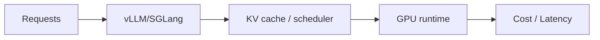

# Serving watchlist - 2026-07-16

- `pytorch/pytorch`: 训练/推理框架底层，compile、distributed、GPU runtime 变化会直接影响大模型工程。 原文：https://github.com/pytorch/pytorch
- `vllm-project/vllm`: LLM serving 高吞吐引擎，关注 batching、KV cache、scheduler 与硬件适配。 原文：https://github.com/vllm-project/vllm
- `sgl-project/sglang`: 高性能 LLM/VLM serving 框架，关注 attention、CUDA、MoE、RL serving 和 scheduler。 原文：https://github.com/sgl-project/sglang
- `NVIDIA/TensorRT-LLM`: NVIDIA GPU inference runtime，代表 kernel、quantization、engine build 与部署优化方向。 原文：https://github.com/NVIDIA/TensorRT-LLM
- `deepspeedai/DeepSpeed`: 分布式训练与推理优化框架，关注 ZeRO、MoE、训练内存与吞吐。 原文：https://github.com/deepspeedai/DeepSpeed

