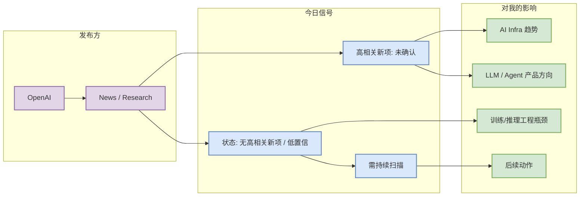

# OpenAI：OpenAI News / Research 固定扫描

> 类型：大厂资讯 / 工程博客 / Research 详情  
> 发布方/大厂：OpenAI  
> 栏目/来源类型：News / Research  
> 推荐等级：无高相关新项 / 低置信  
> 创建日期：2026-08-23  
> 原文链接：https://openai.com/news/  
> 返回日报：[[Daily/2026-08-23]]

## 一句话结论
今日对 OpenAI 的固定来源扫描保留为观察项；若未抓到明确新发布，则以“无高相关新项 / 低置信 / 访问失败”透明记录，避免漏扫。

## TL;DR
- **它是什么**：公司官方来源的固定扫描卡片。
- **为什么重要**：大厂的 research / engineering / product announcement 往往预示训练、推理、agent、安全和开发者工具方向。
- **建议动作**：若后续出现具体新文，替换本观察卡为文章级详情页。

## 元信息
| 字段 | 内容 |
|---|---|
| 发布方/来源 | OpenAI |
| 栏目/来源类型 | News / Research |
| 作者/机构 | OpenAI |
| 发布时间 | 2026-08-23 扫描 |
| 原文 | [原文](https://openai.com/news/) |
| 代码 | 未发现 |
| PDF | 未发现 |

## 信息压缩图示

## 扫描判断矩阵
| 维度 | 判断 | 说明 |
|---|---|---|
| 新项强度 | 无高相关新项 / 低置信 | 今日未确认高相关文章级证据或抓取受限 |
| AI Infra 相关 | 观察 | 继续关注 serving/training/eval/agent infra |
| 对用户价值 | 中 | 大厂方向信号适合做路线雷达，不宜在低置信时过度解读 |

## 相关链接
- 原文：https://openai.com/news/
- 网页详情：https://github.com/dyt27666-oss/AI-news-report-obsidians/blob/main/Industry/2026-08-23/OpenAI-OpenAI%20News%20-%20Research%20%E5%9B%BA%E5%AE%9A%E6%89%AB%E6%8F%8F.md

#ai-radar #industry
