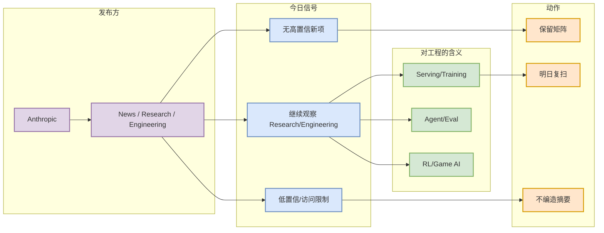

# Anthropic - News / Research / Engineering 固定扫描 - 2026-08-24

> 一句话结论：今日未确认 Anthropic 在 AI Infra / LLM / RL / Agent / Eval 上有高置信新项；保留固定扫描记录，避免漏扫。

## TL;DR
- 发布方/大厂：Anthropic
- 栏目/来源类型：News / Research / Engineering
- 今日状态：无高相关新项 / 低置信；若源站访问失败则以日报矩阵为准。
- 原文入口：https://www.anthropic.com/news

## 信号图

## 可信度与局限性
自动化扫描保留了固定入口，但未阅读全文或 release feed 时不把它升级为“必读”。

## 跟进
明日继续扫描；若出现模型、agent、serving、post-training、eval 或 coding workflow 相关公告，再生成深度详情页。

## 相关链接
- 原文：https://www.anthropic.com/news
- 今日日报：[[Daily/2026-08-24]]

#ai-radar #industry #source-watch
