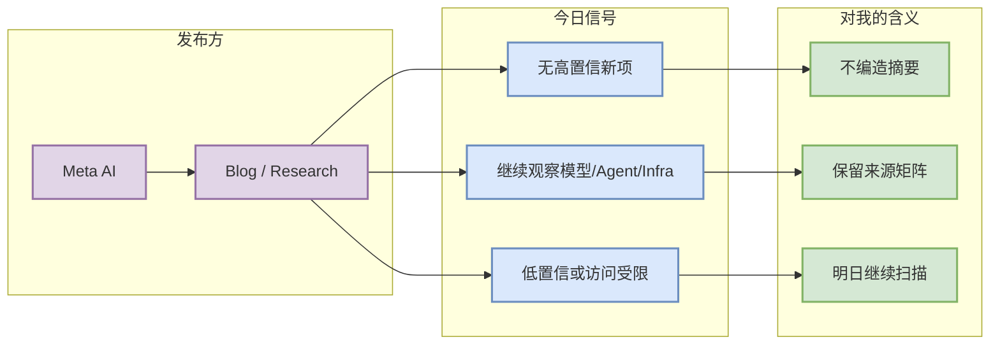

# Meta AI 固定扫描 - 2026-08-25

> 一句话结论：今日未确认 Meta AI 有 AI Infra / LLM / RL / Agent / Eval 强相关高置信新项；保留扫描入口，避免漏扫。

## TL;DR
- 发布方/大厂：Meta AI
- 栏目/来源类型：Blog / Research
- 今日状态：无高相关新项 / 低置信扫描
- 原文：https://ai.meta.com/blog/

## 信号图

## 扫描记录
| 字段 | 值 |
|---|---|
| 发布方/大厂 | Meta AI |
| 栏目/来源类型 | Blog / Research |
| 发布时间 | 今日未确认新项 |
| 作者/机构 | Meta AI |
| 原文链接 | https://ai.meta.com/blog/ |
| 状态 | 无高相关新项 / 低置信 |

## 专业解读
今天该来源没有被提升为必读项。对用户的 AI Infra / RL / Agent 关注点而言，只有涉及 serving、training、post-training、agent eval、coding workflow 或 GPU infra 的内容才应进入高优先级。

## 后续跟进
- 明日继续扫描该来源。
- 若出现模型、agent、eval、inference/training infra 更新，再生成深度详情页。

#ai-radar #industry
