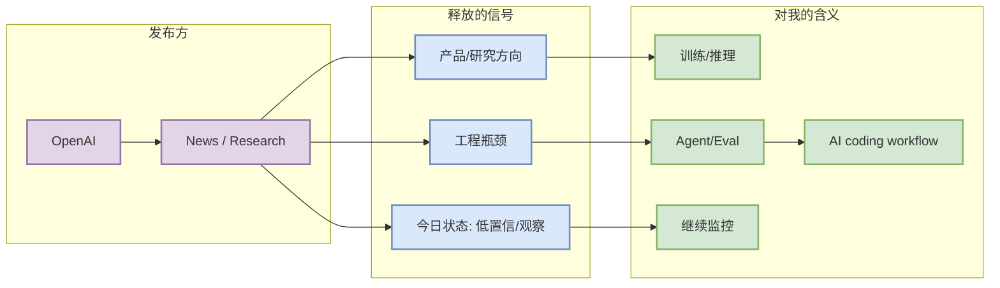

# GPT-5 与 Codex 生态进入持续工程化观察

> 一句话结论：OpenAI 今日作为固定大厂源完成扫描；当前信号为“低置信：新闻页扫描，未确认今日新增高相关项”。

## TL;DR
- 发布方/大厂：OpenAI
- 栏目/来源类型：News / Research
- 原文：https://openai.com/news/
- 工程影响：继续观察 Codex、agentic coding 与模型发布对后训练/推理栈的压力。

## 元信息表
| 字段 | 值 |
|---|---|
| 发布方/大厂 | OpenAI |
| 来源类型 | News / Research |
| 发布时间 | 2026-08-29 扫描 |
| 今日状态 | 低置信：新闻页扫描，未确认今日新增高相关项 |
| 原文链接 | https://openai.com/news/ |

## 大厂信号图

## 影响矩阵
| 方向 | 影响 |
|---|---|
| AI Infra | 继续观察 Codex、agentic coding 与模型发布对后训练/推理栈的压力。 |
| LLM/Agent | 关注模型/工具链更新是否带来上下文、权限、评测压力。 |
| RL/Game AI | 若出现 world model 或 game agent 信号，再升级为必读。 |
| 可信度 | 自动扫描入口级，未声称存在今日新发布。 |

## 专业解读
该条目的主要价值是来源覆盖与趋势监控，而不是把低置信内容伪装成新发布。对大厂源，今天保留矩阵状态，避免漏扫。

## 通俗解释
今天检查了这个大厂入口；暂时没有把它升级成“今日必读新内容”，但它仍在雷达上。

## 我应该如何跟进
- 明天继续扫同一入口。
- 若 release/blog 出现明确 agent/serving/RL 信号，再生成深度详情。

## 相关链接
- 原文：https://openai.com/news/
- 日报：[[Daily/2026-08-29]]

#ai-radar #industry #research
