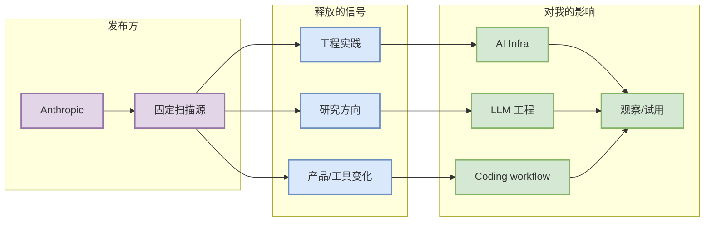

# Anthropic Claude Code release notes

> 一句话结论：今日作为大厂/工具链固定扫描源保留；未把未验证内容写成今日发布。

## TL;DR
- 发布方/大厂：Anthropic
- 栏目/来源类型：Release Notes
- 原文：https://docs.anthropic.com/en/release-notes/claude-code
- 对我的影响：持续影响 AI Infra、coding-agent loop、MCP、权限模式或 serving 工程路线。

## 信息压缩图示

## 辅助结构：信号矩阵
| 维度 | 状态 | 动作 |
|---|---|---|
| 是否今日高置信新增 | 未确认 | 不编造发布日期 |
| 是否继续观察 | 是 | 纳入日报矩阵 |
| 工程价值 | 中-高 | 关注 release/changelog |

## 专业解读
该来源属于固定扫描入口。只有当出现明确与 LLM serving、training、agent、coding workflow 或 RL 强相关更新时，才提升为必读。

## 通俗解释
这是今天检查过的官方入口；没有确认新东西时，也要在矩阵中留痕。

## 对我的影响
用于捕捉大厂方向变化，尤其是工具链、agent、IDE/CLI、MCP、权限和推理栈。

## 可信度与局限性
入口已列入扫描；内容未做深度网页抽取，因此未声称具体新发布。

## 相关链接
- 原文：https://docs.anthropic.com/en/release-notes/claude-code
- Daily：[[Daily/2026-08-30]]

#ai-radar #industry
