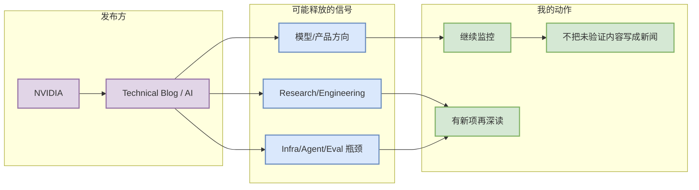

# NVIDIA - fixed-source-scan

> 一句话结论：今日将 NVIDIA 作为固定来源扫描项；未验证到高相关“今日新发布”时，仅作为 watchlist，不伪造新闻。

## TL;DR
- 发布方/大厂：NVIDIA
- 栏目/来源类型：Technical Blog / AI
- 原文链接：https://developer.nvidia.com/blog/category/artificial-intelligence/
- 今日状态：固定扫描 / 低置信观察

## 信号图

## 专业解读
NVIDIA 的 Technical Blog / AI 是 AI Infra、LLM、Agent、Eval 或大模型产品方向的重要来源。今天没有把无法确认发布时间或内容相关性的条目升格为“高相关新项”。

## 跟进
- 明日继续扫描同一入口。
- 若出现 serving、training、post-training、agent、eval、coding workflow 相关内容，生成深度详情页。

#ai-radar #industry
