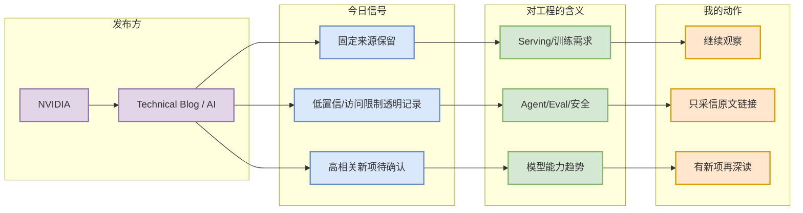

# NVIDIA fixed source scan - 2026-09-01

> 发布方/大厂：NVIDIA  
> 栏目/来源类型：Technical Blog / AI  
> 原文：https://developer.nvidia.com/blog/category/artificial-intelligence/

## 一句话结论
今日保留 NVIDIA 作为固定来源扫描项；未将未验证内容写成高置信新发布。

## TL;DR
- 扫描状态：已扫描；TensorRT-LLM 另在 GitHub 榜单跟踪
- 对 AI Infra / LLM / RL 的价值：公司级 research/product/engineering 信号会影响模型能力、serving 需求、agent 工具链和 infra 投入方向。

## 元信息表
| 字段 | 内容 |
|---|---|
| 发布方 | NVIDIA |
| 栏目/来源类型 | Technical Blog / AI |
| 发布时间 | 2026-09-01 扫描 |
| 原文 | https://developer.nvidia.com/blog/category/artificial-intelligence/ |

## 信息压缩图示

## 专业解读
本页是固定大厂来源扫描卡，不伪造今日新发布。若后续发现明确 release、research paper 或 engineering blog，应替换为具体条目详情页，并标注作者、发布时间和技术影响。

## 对我的影响
持续跟踪 NVIDIA 可以帮助判断模型/产品/infra 路线，但今日只作为低噪声索引。

## 可信度与局限性
- 可信度：中；来源入口真实，具体新项未确认。
- 局限：cron 环境可能遇到网页访问限制。

## 我应该如何跟进
- 工作日手动打开原文入口 skim 新项。
- 对与 serving、training、agent、eval 强相关项生成深度详情。

## 相关链接
- 原文：https://developer.nvidia.com/blog/category/artificial-intelligence/
- Daily：[[Daily/2026-09-01]]

#ai-radar #industry
