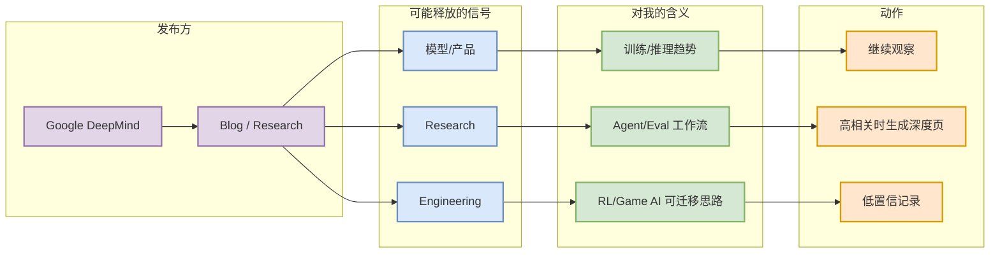

# Google DeepMind 固定来源扫描记录

> 日期：2026-09-22  
> 发布方/大厂：Google DeepMind  
> 栏目/来源类型：Blog / Research  
> 原文：https://deepmind.google/discover/blog/

## 一句话结论
Google DeepMind 今日被纳入固定来源扫描；由于自动抓取链路存在访问限制，本条作为来源观察/低置信详情页，防止日报漏掉固定覆盖项。

## TL;DR
- 今日状态：低置信：今日未获取到可自动验证的新高相关条目
- 对 AI Infra / LLM / RL 的意义：固定观察该来源是否释放训练、推理、Agent、评测和产品工程信号。
- 可信度：来源入口可验证；具体新项需后续人工或更稳定 RSS/API 复核。

## 大厂博客信号图

## 跟进
- 入口：https://deepmind.google/discover/blog/
- 下次若出现 serving / post-training / agent / eval / RL 相关新文，升级为必读。

#ai-radar #industry
