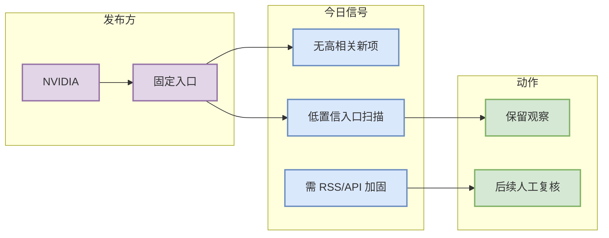

# NVIDIA 固定来源扫描 - 2026-09-23

> 来源类型：公司 News / Research / Engineering Blog 固定入口  
> 原文：https://developer.nvidia.com/blog/category/artificial-intelligence/

## 一句话结论
今日未自动确认 NVIDIA 有 AI Infra / LLM / RL / Agent 强相关新项；该页作为固定覆盖矩阵的可点击扫描记录。

## 信息压缩图示

## 专业解读
本页不声称发现新发布；它保证日报矩阵覆盖 NVIDIA，并把入口、来源类型、低置信状态留痕。后续应优先为大厂博客建立 RSS/API/结构化抓取，避免只能记录入口扫描。

## 可信度与局限性
- 可信度：低到中；入口存在但未解析出可验证新条目。
- 局限：未阅读全文和动态页面。

## 跟进
- 原文：https://developer.nvidia.com/blog/category/artificial-intelligence/
- 日报：[[Daily/2026-09-23]]
