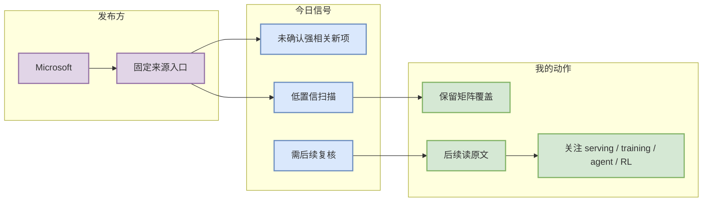

# Microsoft 来源扫描 - 2026-09-24

> 发布方/大厂：Microsoft  
> 栏目/来源类型：News / Research / Engineering Blog / Product Announcement  
> 原文：https://www.microsoft.com/en-us/research/research-area/artificial-intelligence/

## 一句话结论
今日未自动确认 Microsoft 有 AI Infra / LLM / RL / Agent 强相关新项；保留固定来源扫描记录。

## TL;DR
- 状态：无高相关新项 / 低置信或需人工复核。
- 价值：保持来源覆盖，避免只看 GitHub 导致大厂研究/工程信号缺失。
- 下一步：GitHub Search 限流恢复后补抓 RSS/网页正文。

## 信息压缩图示

## 对我的影响
低置信并不等于无价值；它说明今天没有可自动验证的新强信号，但该来源仍需在后续人工/自动抓取中持续覆盖。

## 相关链接
- 原文：https://www.microsoft.com/en-us/research/research-area/artificial-intelligence/
- 今日日报：[[Daily/2026-09-24]]

#ai-radar #industry
