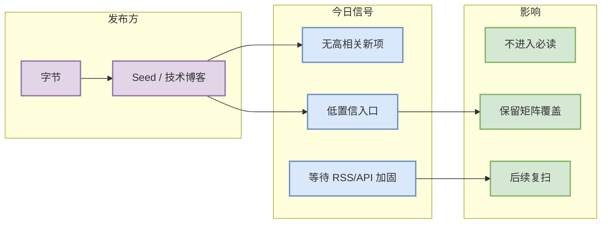

# 字节 来源扫描记录

> 一句话结论：今日未自动确认 字节 有 AI Infra / LLM / RL / Agent 强相关新项；保留固定入口与低置信状态。

## TL;DR
- 发布方/大厂：字节
- 栏目/来源类型：Seed / 技术博客
- 今日状态：低置信 / 无高相关新项 / 访问或解析未形成可验证条目
- 原文：https://seed.bytedance.com/en/

## 信息压缩图示

## 专业解读
本页是固定来源覆盖记录，不代表该公司今天没有任何发布；只表示自动化筛选未得到足够高置信、强相关且可验证的新内容。

## 跟进
- 后续应优先改进 RSS/站点抓取和发布日期解析。
- 如公司发布模型、serving/training infra、agent/eval/RL 相关内容，应升级为必读详情页。

#ai-radar #industry
