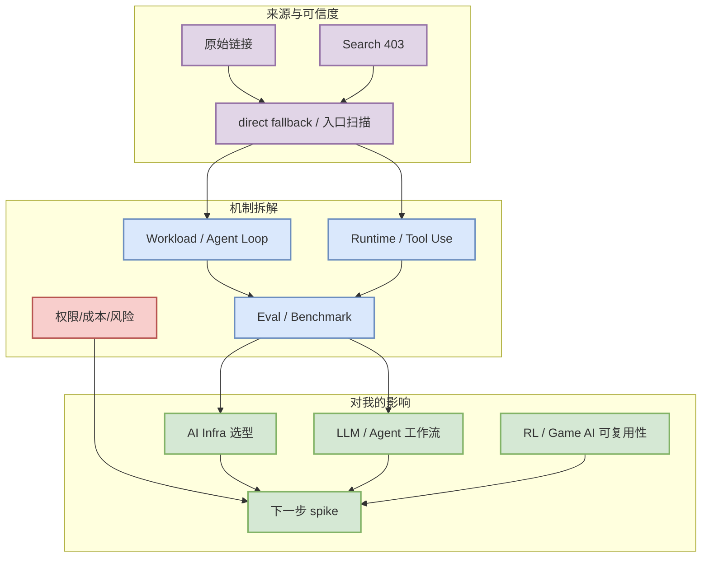

# Serving watchlist: vLLM / SGLang / TensorRT-LLM

> 生成日期：2026-07-20
> 来源类型：GitHub direct watched repo fallback / AI Infra watchlist
> 原文：https://github.com/vllm-project/vllm

## 一句话结论
Serving 三件套仍是今天最高可信工程线索：vLLM 代表调度与 KV cache，SGLang 代表结构化推理/runtime，TensorRT-LLM 代表 NVIDIA GPU 推理优化。

## TL;DR
- 今日 GitHub Search 从第一批查询开始 403，因此本页使用 direct GET /repos 或入口扫描作为 fallback，并明确标注 provenance。
- 重点不是表面热度，而是它能否沉淀为 serving/runtime、agent loop、eval harness、规则环境或 post-training 组件。
- 若涉及 coding 工具，优先复核权限模式、MCP/IDE 集成、远程执行、上下文窗口和 CLI/TUI 体验。

## 元信息表

| 字段 | 值 |
|---|---|
| 类型 | industry |
| 日期 | 2026-07-20 |
| 来源类型 | GitHub direct watched repo fallback / AI Infra watchlist |
| 原文链接 | https://github.com/vllm-project/vllm |
| stars / forks | n/a |
| language | n/a |
| updated_at | n/a |

## 信息压缩图示

## 辅助结构：影响矩阵

| 维度 | 判断 | 说明 |
|---|---|---|
| AI Infra | 中高 | 若影响 serving、runtime、训练框架、工具接入或 eval harness，则保留观察。 |
| LLM / Agent | 高 | CLI/TUI、MCP、权限、上下文和 agent loop 变化直接影响工作流。 |
| RL / Game AI | 中 | 能复用为环境、rollout、reward 或 evaluator 时优先级提升。 |
| 可信度 | 中 | 直接来源可点击，但榜单不是完整全网排名。 |

## 专业解读
Serving 三件套仍是今天最高可信工程线索：vLLM 代表调度与 KV cache，SGLang 代表结构化推理/runtime，TensorRT-LLM 代表 NVIDIA GPU 推理优化。 对用户而言，核心判断是它能否转化为可执行工程动作：降低推理成本、改善 agent loop 可观测性、形成可复用 benchmark，或给 Point Rummy / RL 环境提供规则和评测抽象。

## 通俗解释
可以把它看成今天信息流里的一个高信号节点：不一定马上引入生产，但值得放入 watchlist，并用小实验确认是否真的能节省工程时间。

## 关键机制拆解
- 输入：来自 GitHub、论文、工具 changelog 或公司博客的公开信号。
- 过滤：只保留 AI Infra、LLM、RL、Agent、Eval、Serving、Training、Post-training、World Model、AI coding workflow 强相关内容。
- 输出：进入日报索引，并链接到后续可执行动作。

## 对我的影响
- AI Infra：观察是否降低 serving/training/eval 的复杂度或成本。
- Coding workflow：观察是否改变多 agent 开发、代码审查、权限控制和上下文管理。
- Point Rummy / RL：若涉及游戏环境或不完全信息策略，优先抽象成 gym-like interface。

## 可信度与局限性
- 可信度：中。直接来源可点击，但 GitHub Search 今日 403，榜单明确使用 fallback。
- 局限性：未把 fallback 增长表述为完整全网日增；部分官网 changelog 仅做入口扫描。

## 我应该如何跟进
1. 如果与当前工程栈直接相关，做 30-60 分钟 spike。
2. 如果只是生态信号，加入 watchlist，等待 release notes 或 benchmark。
3. 对工具类项目，重点复核权限模型、上下文窗口、MCP/IDE 集成和 remote execution。

## 相关链接
- 原文：https://github.com/vllm-project/vllm
- 日报：[[Daily/2026-07-20]]

## 标签
#ai-radar #industry #watchlist
