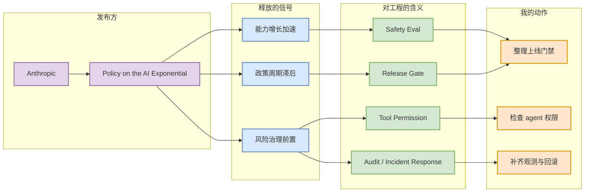

# Policy on the AI Exponential

> 类型：大厂动态 / Policy  
> 大类：Industry  
> 小类：Anthropic  
> 推荐等级：必读  
> 创建日期：2026-06-11  
> 原文链接：https://www.anthropic.com/policy-on-the-ai-exponential  
> 网页详情：https://github.com/dyt27666-oss/AI-news-report-obsidians/blob/main/Industry/Anthropic/2026-06-11-Policy-on-the-AI-Exponential.md  
> 返回日报：[[Daily/2026-06-11]]

## 一句话结论

Anthropic 把 AI 指数级进展明确放入政策与治理框架，工程侧应该预期安全评测、发布门禁、工具权限和事故响应会更快进入产品基础设施。

## TL;DR

- **它是什么**：Anthropic 官方 policy 文章，讨论 AI 进展速度与政策机制之间的节奏差。
- **为什么重要**：当模型能力快速上升，治理要求会影响模型发布、agent 权限、数据留存和部署流程。
- **和我相关的点**：AI Infra 不只是 serving，还要承载安全评测、审计、权限、回滚和合规证据。
- **建议动作**：把它作为 agent / LLM 产品上线前 safety gate 的宏观信号。

## 元信息

| 字段 | 内容 |
|---|---|
| 发布方/来源 | Anthropic News |
| 大厂/实验室 | Anthropic |
| 栏目/来源类型 | Policy / Governance |
| 作者/机构 | Anthropic |
| 发布时间 | 2026-06-10 |
| 原文 | [原文](https://www.anthropic.com/policy-on-the-ai-exponential) |
| 代码 | 不适用 |
| PDF | 不适用 |
| 标签 | #anthropic #policy #ai-safety #agent-eval |

## 信息压缩图示

### 主图：治理信号到工程约束

### 辅助图：风险进入基础设施的位置

| 层级 | 过去常见做法 | 趋势 | 建议 |
|---|---|---|---|
| 模型发布 | 离线 benchmark | safety + capability gate | 增加红队和回归门禁 |
| Agent 权限 | 默认工具可用 | 最小权限和审计 | tool ACL + trace |
| 数据 | 日志留存即可 | 需要可解释证据 | 保留 eval artifact |
| 事故响应 | 手动处理 | 自动降级与回滚 | 预设 kill switch |

## 专业解读

这篇文章不是工程实现，但它是强政策信号。大模型和 agent 产品越接近真实任务，工程系统越需要把安全治理作为一等模块：评测结果要可追踪，模型/工具版本要可回滚，用户数据和工具调用要可审计，发布流程要能证明风险已被检查。

对 AI Infra 的启示是：安全和治理不应外包给文档流程，而要体现在平台能力里，例如 eval pipeline、deployment gate、权限系统、trace、incident dashboard 和逐步灰度。

## 通俗解释

如果模型能力像火箭一样提速，工程团队不能只负责“让火箭飞得快”，还要负责发射审批、轨迹监控、紧急中止和事故复盘。

## 关键机制拆解

| 机制 | 解决的问题 | 为什么有效 | 可能的坑 |
|---|---|---|---|
| Safety eval | 发现能力增长带来的新风险 | 可在发布前发现回归 | 评测集可能滞后 |
| Release gate | 防止风险模型直接上线 | 把治理要求变成自动流程 | 会增加发布摩擦 |
| Tool permission | 控制 agent 外部影响 | 降低误操作和滥用风险 | 权限粒度设计困难 |

## 对我的影响

| 维度 | 影响 | 建议动作 |
|---|---|---|
| AI Infra | 需要 gate、audit、rollback | 把安全评测接入部署系统 |
| LLM 工程 | 模型切换不能只看能力分 | 加入安全回归 |
| RL / Game AI | reward hacking 和策略偏移需审计 | 记录训练数据和 reward 变更 |
| Agent / Eval | 工具权限和长期行动是核心风险 | 建立 tool ACL 和 trace |

## 可信度与局限性

- 证据强度：中；官方政策信号强，但不是技术细节。
- 局限性：没有给出可复现 benchmark 或实现。
- 潜在风险：政策表述可能偏宏观，需结合具体产品判断。
- 还需要确认：Anthropic 是否推出新安全评测或 API 约束。

## 我应该如何跟进

1. 对照内部 agent 平台列出上线门禁缺口。
2. 检查工具权限、审计日志和 kill switch 是否完备。
3. 关注 Anthropic 后续 API / Claude Code / enterprise 安全能力变化。

## 相关链接

- 原文：https://www.anthropic.com/policy-on-the-ai-exponential
- 返回日报：[[Daily/2026-06-11]]

## 标签

#ai-radar #anthropic #policy #ai-safety #agent-eval
