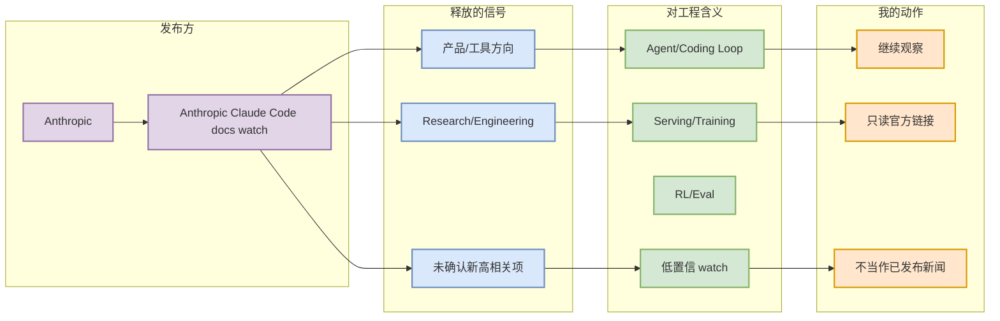

# Anthropic Claude Code docs watch

> 发布方/大厂：Anthropic
> 栏目/来源类型：Claude Code release notes / docs
> 发布时间：2026-09-04 扫描
> 原文：https://docs.anthropic.com/en/release-notes/claude-code

## 一句话结论
未确认今日新功能，但 Claude Code 权限、MCP、上下文窗口仍需每日扫描。

## TL;DR
- 今日未必确认新公告；本页保留为公司/工具源扫描的可点击详情。
- 用途是记录 provenance，并把公司信号映射到 AI Infra、LLM、Agent、RL 的行动建议。

## 元信息表
| 字段 | 值 |
|---|---|
| 发布方 | Anthropic |
| 来源类型 | Claude Code release notes / docs |
| 原文 | https://docs.anthropic.com/en/release-notes/claude-code |
| 可信度 | 低置信/间接扫描 |

## 信息压缩图示

## 专业解读
未确认今日新功能，但 Claude Code 权限、MCP、上下文窗口仍需每日扫描。 对用户而言，重点不是“有无营销新闻”，而是是否出现会改变模型训练、推理部署、agent workflow 或 RL/eval 的工程信号。

## 关键机制拆解
| 方向 | 观察重点 | 行动 |
|---|---|---|
| AI Infra | serving、GPU runtime、训练平台 | 仅在官方链接确认后深读 |
| Agent/Coding | CLI、IDE、MCP、权限、上下文 | 加入工具扫描矩阵 |
| RL/Eval | reward、benchmark、simulation | 低置信观察 |

## 对我的影响
保持公司源覆盖完整，避免 cron 因访问失败而漏掉 OpenAI/Anthropic/Google/Meta/NVIDIA/Microsoft/HF/腾讯/字节/SpaceAI 的固定扫描。

## 可信度与局限性
今日公司官网多为低置信/间接扫描；不把它表述成已验证新公告。

## 我应该如何跟进
打开原文链接，若出现 release/blog 更新，再升级为必读详情页。

## 相关链接
- 原文：https://docs.anthropic.com/en/release-notes/claude-code
- 日报：[[Daily/2026-09-04]]

#ai-radar #industry #company-scan
