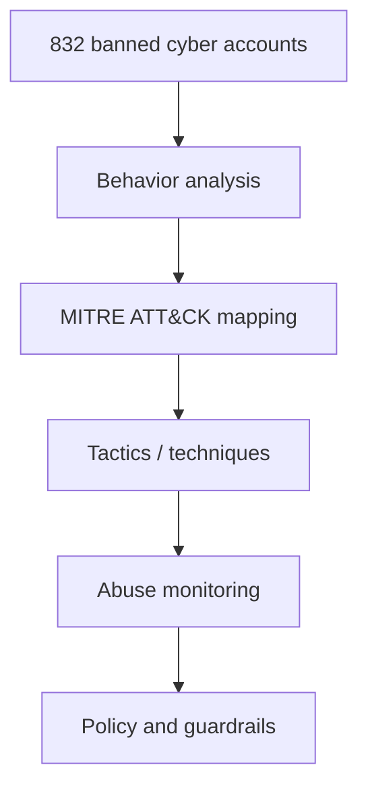

# What we learned mapping a year’s worth of AI-enabled cyber threats

> 类型：大厂博客/工程文章
> 分类：Industry / Anthropic
> 推荐等级：可收藏
> 创建日期：2026-06-08
> 原文链接：https://www.anthropic.com/news/AI-enabled-cyber-threats-mitre-attack

## 一句话结论

Anthropic 分析 2025-03 到 2026-03 被封禁的 832 个恶意网络活动账号，并映射到 MITRE ATT&CK。

## 元信息

- 来源：Anthropic News
- 作者/机构：Anthropic
- 发布时间：2026-06-03
- 原文：https://www.anthropic.com/news/AI-enabled-cyber-threats-mitre-attack
- 相关标签：security, abuse-monitoring, agent

## 专业解读

这篇文章对 Agent 安全和滥用监控有直接价值。Anthropic 用 832 个恶意 cyber activity account 做 MITRE ATT&CK 映射，说明 AI-enabled threat 已经能被纳入传统安全 taxonomy。对平台工程来说，模型网关和 Agent 平台的安全日志应能映射到 ATT&CK-like tactic/technique，而不是只记录 prompt 文本。

## 通俗解释

它在统计坏人怎么用 AI 做网络攻击，并把行为映射到安全行业常用分类，帮助防守方理解风险。

## 图示

## 核心要点

- 样本：2025-03 到 2026-03 的 832 个被封禁账号。
- 方法：映射到 MITRE ATT&CK tactics/techniques。
- 结论：恶意行为者正在用 AI 提升危险性。

## 对我的影响

- AI Infra：模型网关要加入 abuse detection 和安全事件 taxonomy。
- LLM 工程：Agent 工具权限需要最小化和审计。
- RL / Game AI：对抗环境中的 agent 行为监控可借鉴。
- 建议动作：可收藏，用于安全评测和日志规范。

## 局限性 / 风险

- 样本只包含有足够细节可分析的封禁账号，不代表全部恶意活动。
- 安全映射只能帮助理解行为，不能替代实时检测和权限控制。

## 相关链接

- 原文：https://www.anthropic.com/news/AI-enabled-cyber-threats-mitre-attack
- 相关卡片：[[Concepts/Agent Evaluation Contamination]]

## 标签

#ai-radar #industry #anthropic #security #agent
