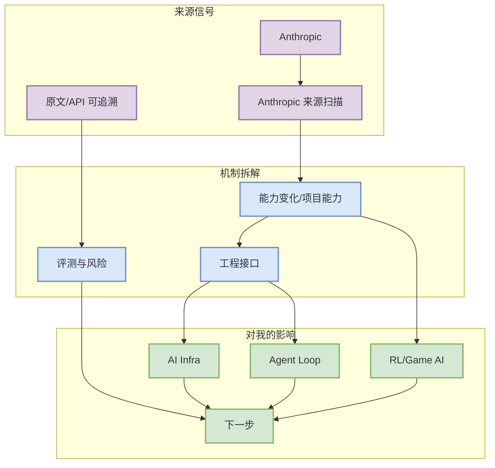

# Anthropic 来源扫描

> 日期：2026-08-08  
> 来源：Anthropic  
> 原文：https://www.anthropic.com/news

## 一句话结论
今日保留公司来源扫描入口；未声明发现高置信全新 AI Infra/LLM/RL 发布。

## TL;DR
- 类别：News / Research / Engineering
- 核心价值：矩阵覆盖用于防漏扫，后续应结合 RSS/官方 changelog 做人工复核。
- 可信度：中等；来自可追溯原文/API，但需要人工阅读完整 changelog、README 或论文正文确认细节。
- 建议动作：加入观察列表；若影响 serving、agent loop、RL 环境或 coding workflow，再做小规模复现。

## 元信息表
| 字段 | 内容 |
|---|---|
| 标题 | Anthropic 来源扫描 |
| 来源 | Anthropic |
| 来源类型 | News / Research / Engineering |
| 日期 | 2026-08-08 |
| 原文 | [link](https://www.anthropic.com/news) |

## 信息压缩图示

## 影响矩阵
| 维度 | 判断 | 说明 |
|---|---|---|
| AI Infra | 中/高 | 关注吞吐、延迟、调度、工具链或模型工程变化。 |
| Agent / Coding Workflow | 中/高 | 关注上下文、权限、工具调用、MCP、评测闭环。 |
| RL / Game AI | 中 | 若涉及自博弈、评测或仿真，可迁移到 Point Rummy 环境。 |
| 生产风险 | 中 | 自动采集只确认元信息，功能细节仍需人工复核。 |

## 专业解读
矩阵覆盖用于防漏扫，后续应结合 RSS/官方 changelog 做人工复核。 对 AI Infra 工程师的价值不在于“有新东西”，而在于它可能改变工具链默认假设：请求如何被组织、agent 如何被约束、评测如何进入闭环，以及哪些组件值得纳入 watchlist。

## 通俗解释
可以把它看成一个新信号：它不一定今天就要落地，但能告诉我们社区正在把算力、工具、agent loop 或游戏 AI 能力往哪个方向推。

## 关键机制拆解
| 模块 | 需要确认的问题 | 跟进方式 |
|---|---|---|
| 功能/论文主张 | 是否真的解决核心瓶颈 | 阅读 README / changelog / PDF |
| 工程入口 | 是否有 API、CLI、examples、benchmark | 拉取最小 demo |
| 风险 | 是否只是营销或低 star 玩具项目 | 看 issue、release、commit 活跃度 |

## 对我的影响
- AI Infra：优先关注 serving、runtime、scheduler、KV cache、训练框架或工具链约束变化。
- AI coding：关注是否影响多 agent 任务分解、权限策略、MCP、review/eval loop。
- Point Rummy：若涉及规则引擎、MCTS/RL、自博弈或仿真，可沉淀为业务 baseline。

## 可信度与局限性
- 可信来源：https://www.anthropic.com/news
- 局限：cron 自动扫描无法替代完整阅读；低 star 项目需要代码审查。

## 我应该如何跟进
1. 打开原文确认 release / README / abstract。
2. 判断是否有 benchmark、docs、examples。
3. 对高价值条目做 30 分钟 spike 或加入 watchlist。

## 相关链接
- [原文](https://www.anthropic.com/news)

#ai-radar #industry #2026-08-08
