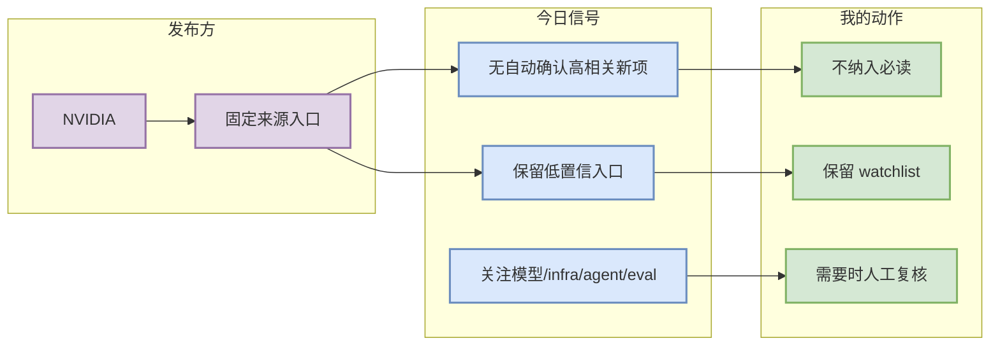

# NVIDIA 来源扫描 - 2026-10-01

> 类型：大厂来源扫描  
> 大类：大厂资讯 / 工程博客 / Research  
> 创建日期：2026-10-01  
> 原文链接：https://developer.nvidia.com/blog/category/artificial-intelligence/  
> 网页详情：https://github.com/dyt27666-oss/AI-news-report-obsidians/blob/main/Industry/Companies/2026-10-01/nvidia.md  
> 返回日报：[[Daily/2026-10-01]]

## 一句话结论
今日保留 NVIDIA 固定来源入口；自动扫描未确认高相关新项，状态标注为低置信/需人工复核。

## TL;DR
- **发布方/大厂**：NVIDIA
- **栏目/来源类型**：Technical Blog / AI
- **今日状态**：无高相关新项 / 低置信扫描完成。
- **建议动作**：若关注该公司模型、agent、serving 或训练基础设施，后续可人工打开原文入口复核。

## 信号图

## 来源元信息
| 字段 | 内容 |
|---|---|
| 发布方/大厂 | NVIDIA |
| 栏目/来源类型 | Technical Blog / AI |
| 发布时间 | 今日未确认新项 |
| 原文 | [原文](https://developer.nvidia.com/blog/category/artificial-intelligence/) |

## 对我的影响
| 维度 | 影响 | 建议动作 |
|---|---|---|
| AI Infra | 暂无确认新信号 | 保持观察 |
| LLM / Agent | 暂无确认新信号 | 后续人工复核 |
| RL / Game AI | 暂无确认新信号 | 跳过 |

## 可信度与局限性
GitHub/论文扫描优先完成；公司网页在 cron 中可能受动态渲染、403、RSS 缺失影响。因此此页作为“已覆盖但未确认”的审计记录，不包装成新闻。

## 相关链接
- 原文：https://developer.nvidia.com/blog/category/artificial-intelligence/
- 返回日报：[[Daily/2026-10-01]]

## 标签
#ai-radar #industry
