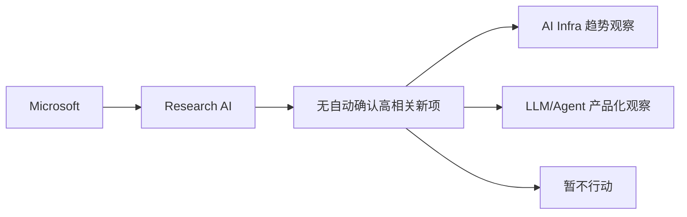

# Microsoft 固定来源扫描 - 2026-10-02

> 类型：大厂资讯 / 工程博客 / Research
> 发布方/大厂：Microsoft
> 栏目/来源类型：Research AI
> 推荐等级：低置信
> 原文链接：https://www.microsoft.com/en-us/research/research-area/artificial-intelligence/
> 返回日报：[[Daily/2026-10-02]]

## 一句话结论
今日保留 Microsoft 固定来源入口；自动采集未确认高相关新项，因此标注为“低置信 / 无高相关新项”。

## 信息压缩图示

## 扫描矩阵
| 字段 | 内容 |
|---|---|
| 发布方/大厂 | Microsoft |
| 栏目/来源类型 | Research AI |
| 今日状态 | 低置信扫描完成，无自动确认高相关新项 |
| 原文 | [原文](https://www.microsoft.com/en-us/research/research-area/artificial-intelligence/) |

## 专业解读
本页维持公司来源扫描矩阵完整性，避免因为抓取失败或没有新内容而漏掉来源。若后续人工复核发现强相关内容，再升级为必读详情。

## 标签
#ai-radar #industry #company
