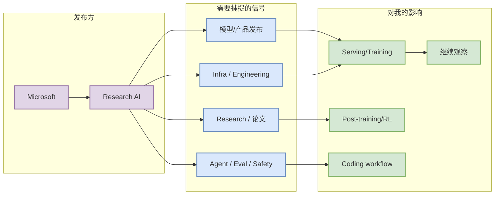

# Microsoft 来源扫描

> 一句话结论：今日固定公司来源扫描；状态为“无高相关新项 / 低置信 / 入口保留”。

## TL;DR
- 发布方/大厂：Microsoft
- 栏目/来源类型：Research AI
- 发布时间：未从自动 API 确认，低置信
- 原文链接：https://www.microsoft.com/en-us/research/research-area/artificial-intelligence/

## 信息压缩图示

## 专业解读
该页保证日报中的公司来源扫描矩阵可点击。今日自动化没有确认该来源存在 AI Infra、LLM、RL、Agent、Eval 或 coding workflow 强相关新项；因此不冒充新新闻，只保留低置信入口和后续跟踪动作。

## 可信度与局限性
低置信：仅记录来源入口或扫描状态，不代表完整抓取成功。

#ai-radar #industry
