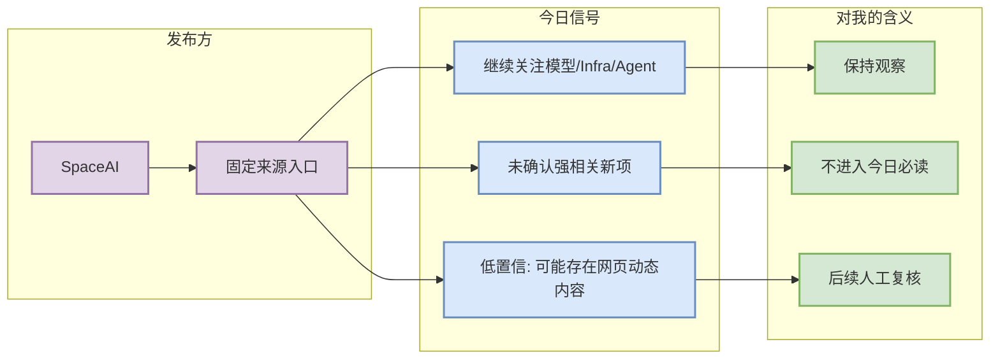

# SpaceAI 固定来源扫描 - 2026-10-04

> 一句话结论：今日未自动确认 SpaceAI 有 AI Infra / LLM / RL / Agent / Coding workflow 强相关新项；保留为固定矩阵入口。

## TL;DR
- 发布方/大厂：SpaceAI
- 栏目/来源类型：News / Research / Engineering Blog / Product Announcement（按来源入口归类）
- 今日状态：无高相关新项 / 低置信扫描完成
- 原文入口：https://spaceai.com/

## 信号图

## 专业解读
固定来源扫描的价值不在于每天都产出新闻，而在于避免漏掉大厂关于训练、推理、agent、安全、评测和开发者工具链的方向变化。今天没有自动确认强相关新项，因此不把它误报为新闻。

## 可信度与局限性
- 可信度：中低；网页可能有动态加载或地域限制。
- 局限性：未做全文抓取与人工复核。

## 相关链接
- 原文入口：https://spaceai.com/
- Daily：[[Daily/2026-10-04]]

#AI-Radar #Industry
