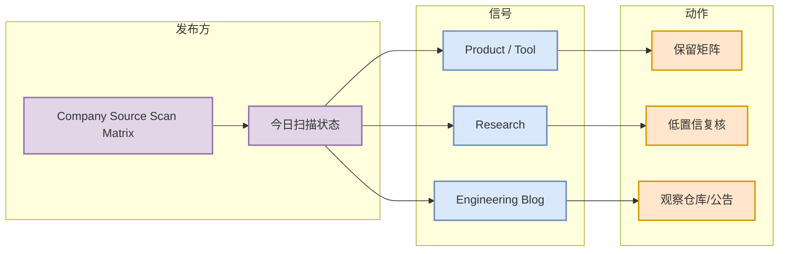

# Company Source Scan Matrix

> 日期：2026-07-24
> 类型：Industry / Company Matrix
> 原文：https://openai.com/news/

## 一句话结论

今日公司博客未确认 6-10 条高置信新项，保留 OpenAI/Anthropic/DeepMind/Meta/NVIDIA/Microsoft/HF/腾讯/字节/SpaceAI 全覆盖矩阵。

## TL;DR

- 今日用途：作为 AI Radar 日报的详情页，承接导航页中的条目。
- 可信度：GitHub direct repo metadata 高于 Search 结果；博客和论文源若标低置信，则需要后续复核。
- 对我的价值：优先服务 AI Infra、LLM serving/training、agent loop、coding workflow、Point Rummy/Game AI 判断。

## 元信息表

| 字段 | 内容 |
|---|---|
| 标题 | Company Source Scan Matrix |
| 类别 | Industry / Company Matrix |
| 日期 | 2026-07-24 |
| 原文 | https://openai.com/news/ |
| 日报 | [[Daily/2026-07-24]] |

## 信息压缩图示

## 辅助结构：影响矩阵

| 维度 | 判断 | 行动 |
|---|---|---|
| AI Infra / Serving | 关注 runtime、吞吐、调度、缓存和部署边界 | 只对可复现实验或活跃仓库深挖 |
| Agent / Coding Loop | 关注 CLI/TUI、MCP、权限、上下文和评测闭环 | 进入 tmux 多 agent / review loop 观察 |
| RL / Game AI | 关注环境建模、self-play、MCTS/ISMCTS、奖励设计 | Point Rummy 仅拆可复用模块，不迷信 star |
| 可信度 | 今日部分 API 429/403 | 明确标注 fallback / low-confidence |

## 专业解读

今日公司博客未确认 6-10 条高置信新项，保留 OpenAI/Anthropic/DeepMind/Meta/NVIDIA/Microsoft/HF/腾讯/字节/SpaceAI 全覆盖矩阵。 对用户更有价值的不是“新闻本身”，而是它是否改变工程决策：例如是否影响 serving 栈选型、post-training/RL 实验设计、coding-agent loop 的权限边界，或 Point Rummy 环境/规则/评测模块拆分。

## 通俗解释

可以把这条看作今天的一个“信号源”：它要么说明某类工具正在升温，要么说明某个来源今天没有足够可靠的新内容。日报只放导航，详情页记录为什么值得保留或为什么暂时低置信。

## 关键机制拆解

| 机制 | 观察点 | 风险 |
|---|---|---|
| 数据来源 | GitHub API / 官方博客 / arXiv | Search 403、arXiv 429、网页访问失败 |
| 工程价值 | 是否能试用、复现、迁移 | star 增长不等于生产可用 |
| 决策价值 | 是否影响今天阅读或实验优先级 | 低置信条目不能作为强结论 |

## 对我的影响

- AI Infra：优先看可落地 runtime、scheduler、cache、distributed training 线索。
- LLM / Agent：优先看工具协议、agent loop、权限与上下文窗口。
- RL / Game AI：优先看环境并行、reward、MCTS/ISMCTS、自博弈和评测。

## 可信度与局限性

今日 GitHub Search 大量 403，arXiv 429/timeout；因此榜单采用 direct watched-repo fallback 和低置信 watchlist，不把 fallback 描述为完整全网趋势。

## 我应该如何跟进

1. 对必读仓库：看 release notes、examples、issue 活跃度。
2. 对低置信来源：稍后重新查询官方页面或 API。
3. 对 Point Rummy：只抽象规则/仿真/评测模块，不直接采用低 star 代码。

## 相关链接

- [原文](https://openai.com/news/)
- [日报](https://github.com/dyt27666-oss/AI-news-report-obsidians/blob/main/Daily/2026-07-24.md)

## 标签

#ai-radar #detail #ai-infra #llm #rl #point-rummy #loop-engineering
