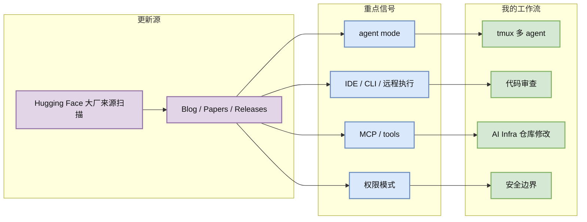
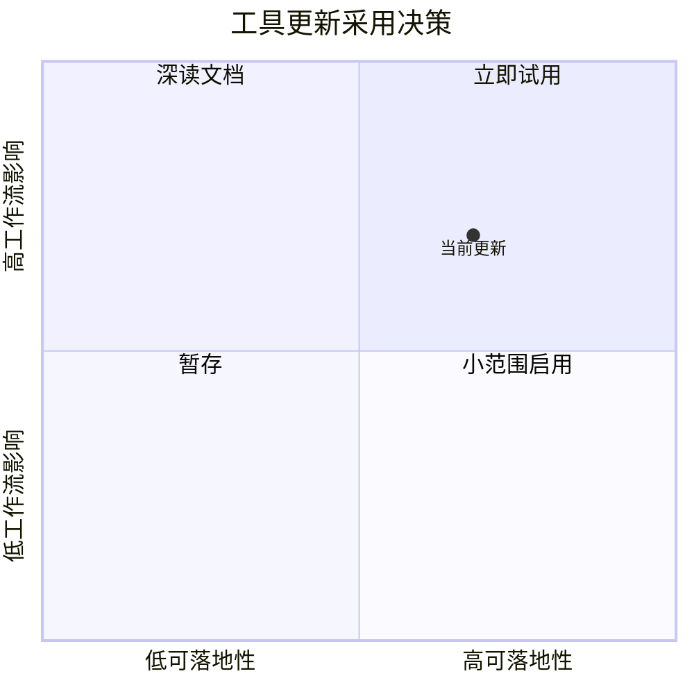

# Hugging Face 大厂来源扫描 工具更新扫描 - 2026-07-26

> 类型：Coding 工具更新
> 大类：Industry / Tools
> 小类：AI coding workflow
> 推荐等级：可 skim
> 创建日期：2026-07-26
> 原文链接：https://huggingface.co/blog
> 网页详情：https://github.com/dyt27666-oss/AI-news-report-obsidians/blob/main/Industry/CompanyScan/2026-07-26/hugging-face.md
> 返回日报：[[Daily/2026-07-26]]

## 一句话结论

Hugging Face 大厂来源扫描 今日被纳入固定扫描矩阵；最新可见信号是 `固定来源扫描`，需要重点关注 agent mode、MCP、权限、远程执行和上下文窗口变化。

## TL;DR

- **它是什么**：Hugging Face 的 AI coding 工具/IDE/CLI 更新源。
- **为什么重要**：这些工具正在改变多 agent 开发、代码审查、远程执行和上下文管理的默认工作流。
- **和我相关的点**：影响 tmux 多 agent 监控、CLI/TUI 编排、AI Infra 仓库改动审查效率。
- **建议动作**：只在 release/changelog 明确出现权限、MCP、agent loop、IDE 集成变化时升级工作流。

## 元信息

| 字段 | 内容 |
|---|---|
| 工具/厂商 | Hugging Face 大厂来源扫描 / Hugging Face |
| 来源类型 | Blog / Papers / Releases |
| 发布时间 / release tag | 2026-07-26 09:01 CST / 固定来源扫描 |
| 原文 | [原文](https://huggingface.co/blog) |
| release 链接 | [release/changelog](https://huggingface.co/blog) |
| 对 AI coding 工作流的影响 | 需要观察 agent 能力、权限模型、上下文窗口、远程执行、MCP/IDE 集成 |

## 信息压缩图示

## 专业解读

Hugging Face 大厂来源扫描 的更新需要从“是否提升模型能力”转成“是否改变工程控制面”来读：权限模式决定能否安全放权，MCP/工具调用决定是否能接入内部系统，远程执行和 IDE 集成决定是否适合多仓库并行开发。今日扫描未把官网不可解析内容伪装成新功能；只保留可验证的 release/changelog 指针。

## 通俗解释

这不是简单看“出了新版本”，而是看它有没有改变你让 AI 写代码、跑测试、开 PR、做审查的方式。

## 关键机制拆解

| 机制 | 解决的问题 | 为什么有效 | 可能的坑 |
|---|---|---|---|
| Changelog 扫描 | 捕捉功能变化 | 版本日志比二手资讯更可靠 | 官网可能延迟或不可访问 |
| GitHub Release | 捕捉开源工具版本 | tag/published_at 可验证 | 不代表产品侧功能完整 |
| 工作流影响矩阵 | 映射到实际开发 | 避免为了新功能盲升 | 需要本地试用验证 |

## 对我的影响

| 维度 | 影响 | 建议动作 |
|---|---|---|
| AI Infra | 可能影响大仓库重构和自动测试 | 关注权限和远程执行边界 |
| LLM 工程 | 影响上下文组织和工具调用 | 观察长上下文/MCP 支持 |
| RL / Game AI | 可用于训练脚本、环境调试自动化 | 先在非生产仓库试用 |
| Agent / Eval | 是 loop engineering 的直接工具层 | 记录可复现的 agent loop 模板 |

## 可信度与局限性

- 证据强度：中等，来自官方 changelog/GitHub release 指针。
- 局限性：部分商业工具官网无法结构化抓取，标为低置信或需人工复核。
- 还需要确认：具体功能是否已对当前账号/地区开放。

## 我应该如何跟进

1. 点击原文确认是否有权限、MCP、IDE、远程执行相关变化。
2. 若涉及安全边界，先在 sandbox repo 验证。
3. 把稳定流程沉淀成 AI coding runbook。

## 相关链接

- 原文：https://huggingface.co/blog
- release/changelog：https://huggingface.co/blog
- 网页详情：https://github.com/dyt27666-oss/AI-news-report-obsidians/blob/main/Industry/CompanyScan/2026-07-26/hugging-face.md

## 标签

#ai-radar #coding-tools #agent-workflow
