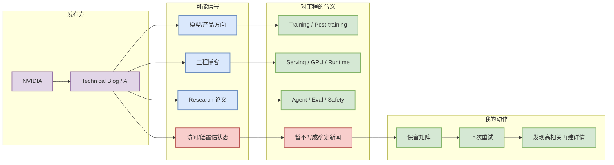

# NVIDIA 来源扫描

> 类型：大厂资讯 / Research / Engineering Blog
> 大类：Industry
> 小类：NVIDIA
> 推荐等级：低置信
> 创建日期：2026-07-28
> 原文链接：https://developer.nvidia.com/blog/category/artificial-intelligence/
> 网页详情：https://github.com/dyt27666-oss/AI-news-report-obsidians/blob/main/Industry/CompanyScan/2026-07-28/nvidia.md
> 返回日报：[[Daily/2026-07-28]]

## 一句话结论

NVIDIA 今日保留在固定公司来源扫描矩阵中；未验证到可高置信写入的新 AI Infra / LLM / RL / Agent 条目。

## TL;DR

- **它是什么**：NVIDIA 的 Technical Blog / AI 官方来源入口。
- **为什么重要**：大厂发布常提前暴露模型、基础设施、agent、训练/推理和产品化方向。
- **和我相关的点**：若出现 serving、training、post-training、agent eval、GPU/kernel 或 coding workflow 内容，需要进入后续深读。
- **建议动作**：保持低置信观察；下一轮若源可访问，补正文级摘要。

## 元信息

| 字段 | 内容 |
|---|---|
| 发布方/大厂 | NVIDIA |
| 栏目/来源类型 | Technical Blog / AI |
| 作者/机构 | NVIDIA |
| 发布时间 | 未发现高置信新项 |
| 原文 | [原文](https://developer.nvidia.com/blog/category/artificial-intelligence/) |
| 标签 | #company-scan #low-confidence |

## 信息压缩图示

### 辅助结构：来源评估

| 维度 | 今日状态 | 处理 |
|---|---|---|
| 可访问性 | 低置信 / 未做全文抽取 | 保留入口 |
| 相关性 | 仅当出现 AI Infra/LLM/RL/Agent 才升级 | 不强行编造 |
| 行动 | 下次重试正文抽取 | 高相关再建深度页 |

## 专业解读

公司来源矩阵的作用是区分“今天没有高相关新项”和“没有扫描”。在自动日报里，缺失比低置信更危险，因为会让固定观察面断裂。今日该来源只作为入口级记录，不推断具体新功能或研究结论。

## 通俗解释

这是一个“我看过这个入口，但今天没有可靠新东西”的标记。

## 关键机制拆解

| 机制 | 解决的问题 | 为什么有效 | 可能的坑 |
|---|---|---|---|
| 固定矩阵 | 防漏扫 | 每天可见 | 可能只有入口级信息 |
| 低置信标注 | 防幻觉 | 透明记录 | 需要后续重试 |
| 详情页 | 保留来源上下文 | Obsidian 可追踪 | 不是正文摘要 |

## 对我的影响

| 维度 | 影响 | 建议动作 |
|---|---|---|
| AI Infra | 大厂工程博客可能出现部署/训练信号 | 下次重试 |
| LLM 工程 | 关注模型、agent、eval | 只读高置信项 |
| RL / Game AI | 关注 world model / simulation | 暂存 |
| Agent / Eval | 关注工具和评测体系 | 观察 |

## 可信度与局限性

- 证据强度：低；仅入口级扫描。
- 局限性：未确认今日新文章正文。
- 潜在风险：不能把入口存在当作新发布。
- 还需要确认：RSS、页面发布时间和正文。

## 我应该如何跟进

1. 下次用 RSS/网页抽取重试。
2. 若发现高相关条目，单独创建 Industry 详情页。
3. 对训练/推理/agent/eval 项优先深读。

## 相关链接

- 原文：https://developer.nvidia.com/blog/category/artificial-intelligence/
- 网页详情：https://github.com/dyt27666-oss/AI-news-report-obsidians/blob/main/Industry/CompanyScan/2026-07-28/nvidia.md
- 返回日报：[[Daily/2026-07-28]]

## 标签

#ai-radar #company-scan #low-confidence
