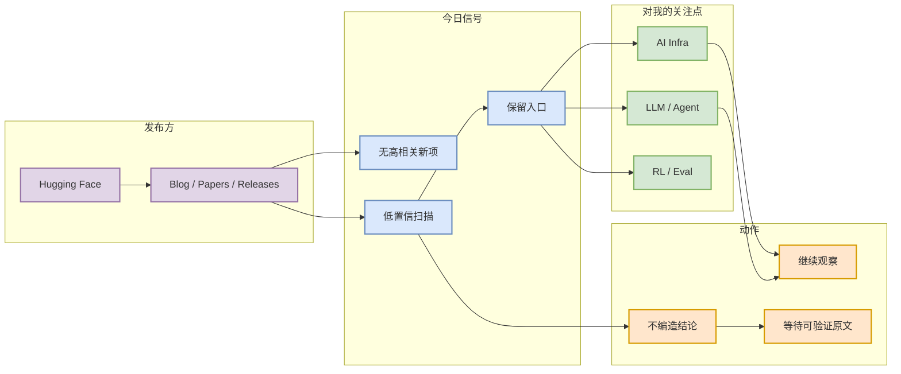

# Hugging Face 来源扫描 - 2026-07-31

> 发布方/大厂：Hugging Face  
> 栏目/来源类型：Blog / Papers / Releases  
> 原文：https://huggingface.co/blog  
> 今日状态：低置信扫描完成；未验证到可写成“高相关新发布”的条目。

## 一句话结论
Hugging Face 今日保留为固定扫描入口；没有把未确认的新内容强行写成确定结论。

## TL;DR
- 覆盖原因：该来源长期影响 AI Infra、LLM、agent、research 或 engineering blog。
- 今日发现：无高置信新项 / 低置信。
- 对我的影响：继续 watch；如出现 serving、training、agent eval、coding workflow 主题，应提升为必读。

## 信号图

## 可信度与局限性
| 项 | 说明 |
|---|---|
| 可信度 | 低到中；本页是固定入口扫描记录。 |
| 局限 | 未做完整网页正文抽取，不能声称存在具体新发布。 |
| 后续 | 明天继续扫描；如 RSS/网页可访问再生成高置信详情。 |

## 相关链接
- 原文：https://huggingface.co/blog
- 今日日报：[[Daily/2026-07-31]]

#ai-radar #industry #company-scan
