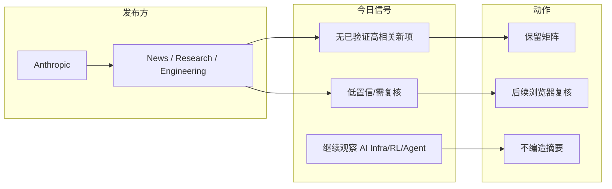
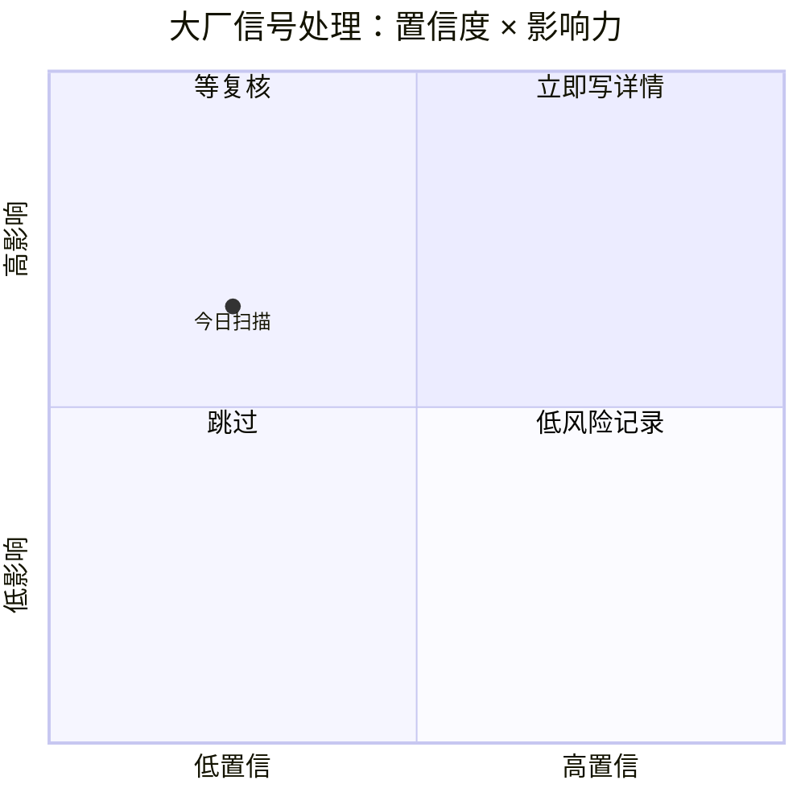

# Anthropic 来源扫描 - 2026-09-06

> 类型：大厂来源扫描
> 大类：Industry
> 小类：Anthropic
> 推荐等级：低置信
> 创建日期：2026-09-06
> 原文链接：https://www.anthropic.com/news
> 网页详情：https://github.com/dyt27666-oss/AI-news-report-obsidians/blob/main/Industry/CompanyScan/2026-09-06/anthropic.md
> 返回日报：[[Daily/2026-09-06]]

## 一句话结论
今日 Anthropic 固定来源已纳入扫描矩阵，但未确认到强相关新项；状态为：低置信/需浏览器复核。

## TL;DR
- **发布方/大厂**：Anthropic
- **栏目/来源类型**：News / Research / Engineering
- **今日状态**：低置信/需浏览器复核
- **为什么仍保留**：固定矩阵防止遗漏大厂 engineering/research 信号。

## 信息压缩图示

## 专业解读
固定扫描 Anthropic 的意义是捕捉大厂在模型、agent、RL、推理与工程平台方向的信号。今日没有可验证强相关新项，因此只做 provenance 记录，不把未确认网页内容写成结论。

## 可信度与局限性
- 证据强度：低到中；来源 URL 已记录。
- 局限性：未完成全文提取。
- 下一步：人工或后续 cron 复核 RSS/页面更新。

## 相关链接
- 原文：https://www.anthropic.com/news
- 网页详情：https://github.com/dyt27666-oss/AI-news-report-obsidians/blob/main/Industry/CompanyScan/2026-09-06/anthropic.md

## 标签
#ai-radar #industry #anthropic
