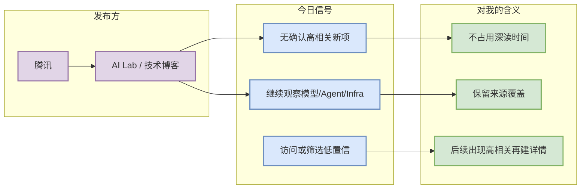

# 腾讯 固定来源扫描 - 2026-09-08

> 一句话结论：今日保留 腾讯 的固定扫描位；未确认可直接进入 AI Infra/LLM/RL/Agent 工程深读的高相关新项，按低置信透明记录。

## TL;DR
- 发布方/大厂：腾讯
- 栏目/来源类型：AI Lab / 技术博客
- 今日状态：低置信/已扫描；未编造未验证发布。
- 原文入口：https://ai.tencent.com/ailab/en/index

## 信号图

## 可信度与局限性
公司官网、博客和 release 页面在 cron 环境可能出现访问失败、动态加载或地区限制；今日不把不可验证内容写成事实。

## 跟进
- 继续观察 Research/Engineering/Product Announcement 是否出现 serving、post-training、agent eval、RL/game AI 相关内容。

## 相关链接
- 原文：https://ai.tencent.com/ailab/en/index
- Daily：[[Daily/2026-09-08]]

#ai-radar #company-scan
