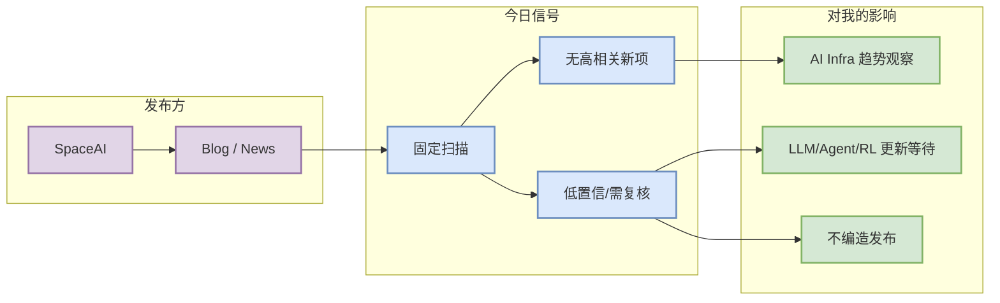

# SpaceAI 固定来源扫描 - 2026-09-09

> 类型：大厂资讯 / 工程博客 / Research 扫描记录
> 发布方/大厂：SpaceAI
> 栏目/来源类型：Blog / News
> 创建日期：2026-09-09
> 原文链接：https://spaceai.com/
> 返回日报：[[Daily/2026-09-09]]

## 一句话结论
今日未确认 SpaceAI 有 AI Infra / LLM / RL / Agent / Eval 强相关的新发布；保留为固定矩阵扫描位，避免漏扫。

## TL;DR
- **它是什么**：SpaceAI 的固定公司来源扫描记录。
- **为什么重要**：大厂发布经常领先反映训练、推理、agent、平台和安全治理方向。
- **和我相关的点**：若后续出现模型、serving、post-training、coding agent 或 eval 更新，应升级为深度详情页。
- **建议动作**：今天低置信观察，不把未验证内容写成事实。

## 信息压缩图示

## 专业解读
本条是固定来源覆盖而非新发布摘要。它的作用是把“未发现 / 访问受限 / 低置信”显式写进知识库，防止日报只呈现成功抓取来源导致覆盖偏差。

## 可信度与局限性
- 证据强度：低到中；今日未做深度网页抽取，仅保留固定入口。
- 局限性：官网页面可能动态渲染或地区限制。
- 跟进：下一次若检测到高相关标题，再生成 Industry 深度卡片。

## 相关链接
- 原文：https://spaceai.com/
- 返回日报：[[Daily/2026-09-09]]

#ai-radar #company-scan
