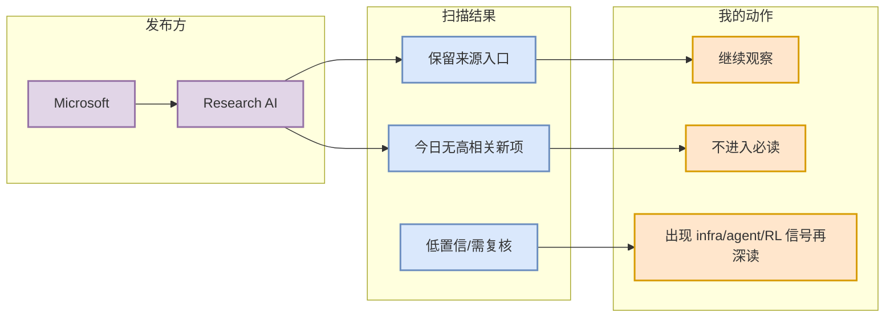

# Microsoft 固定来源扫描 - 2026-09-10

> 发布方/大厂：Microsoft  
> 栏目/来源类型：Research AI  
> 原文：[https://www.microsoft.com/en-us/research/research-area/artificial-intelligence/](https://www.microsoft.com/en-us/research/research-area/artificial-intelligence/)

## 一句话结论
今日未确认到与 AI Infra / LLM / RL / Agent / Eval 强相关的高置信新项，保留扫描记录，避免误判为漏扫。

## TL;DR
- 状态：低置信 / 已扫描。
- 高相关条数：0。
- 处理原则：不编造未验证发布；后续若出现模型、agent、eval、serving/training infra 更新，再生成深度详情。

## 信息压缩图示

## 可信度与局限性
公司页面可能有地域、动态渲染或 RSS 延迟；今日记录只代表本次 cron 的高相关筛选结果。

## 跟进
- 下次重点捕捉：模型发布、agent/product infra、推理/训练工程、eval、安全治理、RL/game AI。
- 原文入口：https://www.microsoft.com/en-us/research/research-area/artificial-intelligence/

#ai-radar #company-scan
