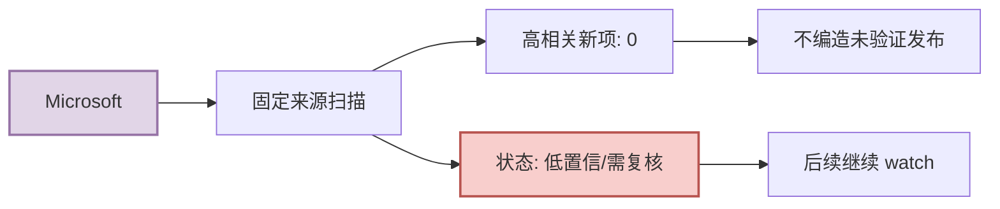

# Microsoft 固定来源扫描 - 2026-09-11

> 类型：大厂来源扫描  
> 发布方/大厂：Microsoft  
> 栏目/来源类型：Research AI  
> 原文链接：https://www.microsoft.com/en-us/research/research-area/artificial-intelligence/  
> 返回日报：[[Daily/2026-09-11]]

## 一句话结论

今日未确认到与 AI Infra / LLM / RL / Agent / Eval / Serving 强相关的新项；保留扫描记录，避免漏扫误判。

## 信息压缩图示

## 元信息

| 字段 | 内容 |
|---|---|
| 发布方/来源 | Microsoft |
| 栏目/来源类型 | Research AI |
| 发布时间 | 2026-09-11 扫描 |
| 今日状态 | 无高相关新项 / 低置信 |
| 原文 | [来源](https://www.microsoft.com/en-us/research/research-area/artificial-intelligence/) |

## 对我的影响

| 方向 | 判断 | 动作 |
|---|---|---|
| AI Infra | 今日无明确新增 | 继续 watch |
| LLM/Agent | 今日无明确新增 | 等待可验证 release/blog |
| RL/Game AI | 今日无明确新增 | 不纳入必读 |

## 可信度与局限性

- 固定矩阵扫描记录，不等于该公司无发布；仅表示本轮未确认强相关新项。
- 若后续 RSS/网页/API 可用，应补充具体文章详情页。

## 相关链接

- 原文：https://www.microsoft.com/en-us/research/research-area/artificial-intelligence/
- 返回日报：[[Daily/2026-09-11]]

#ai-radar #company-scan
