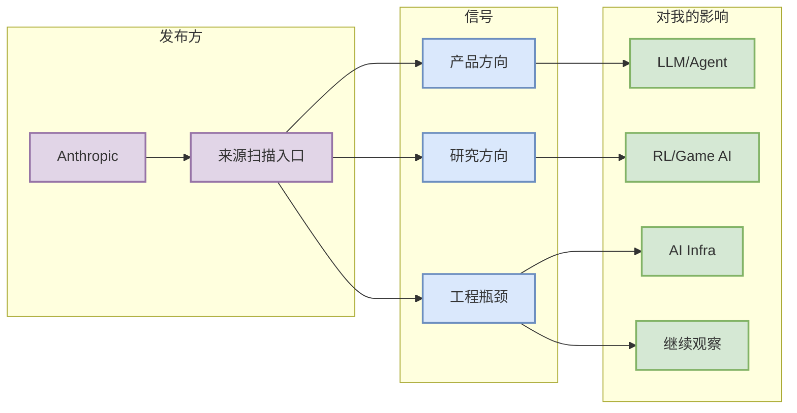

# Anthropic - 来源扫描入口

> 一句话结论：今日公司来源扫描项；状态：无高相关新项 / 低置信。

## TL;DR
- 发布方/大厂：Anthropic
- 栏目/来源类型：News / Research / Engineering Blog / Product Announcement
- 发布时间：未从自动 API 确认，低置信
- 原文链接：https://www.anthropic.com/news

## 信息压缩图示

## 专业解读
该页用于保证大厂来源矩阵的可点击追踪。今日自动扫描未对该来源确认高相关新项；后续若出现模型发布、训练/推理基础设施、agent/eval、coding workflow 或 RL/world model 相关更新，应升级为必读并补全发布时间、作者和技术细节。

## 可信度与局限性
低置信：仅记录来源入口或扫描状态，不代表完整抓取成功。

#ai-radar #industry
