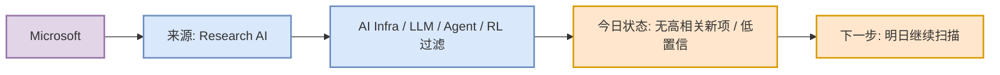

# Microsoft 来源扫描 - 2026-09-14

> 发布方/大厂：Microsoft
> 栏目/来源类型：Research AI
> 原文：https://www.microsoft.com/en-us/research/research-area/artificial-intelligence/

## 一句话结论
今日未确认到强相关新项；保留扫描入口，避免漏扫。

## 信息压缩图示

## 扫描判断
| 字段 | 值 |
|---|---|
| 今日状态 | 无高相关新项 / 低置信 |
| 高相关条数 | 0 |
| 原文入口 | https://www.microsoft.com/en-us/research/research-area/artificial-intelligence/ |
| 后续动作 | 继续关注模型、agent、eval、serving、training、RL 信号 |

## 可信度与局限性
当前 cron 以固定来源入口和低置信状态保留矩阵；若站点反爬或没有 RSS/API，不声称完整抓取。

#ai-radar #company-scan
