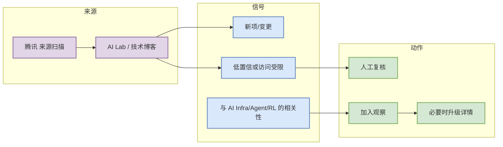

# 腾讯 来源扫描

> 日期：2026-09-29  
> 来源类型：AI Lab / 技术博客  
> 原文：https://ai.tencent.com/ailab/en/index

## 一句话结论
腾讯 今日未确认强相关新项或源站需人工复核；矩阵保留以证明已覆盖扫描。

## TL;DR
- 这是今日 AI Radar 的低置信/观察类详情页，用于保证 Daily 导航可点击。
- 若后续源站出现明确 release、论文或工程博客，需要升级为深读页。
- 当前价值：给 AI Infra / LLM / Agent / RL 工作流提供来源入口和复核锚点。

## 信息压缩图示

## 影响矩阵
| 维度 | 判断 |
|---|---|
| AI Infra | 需要复核是否有 serving/training/eval 信号 |
| Coding workflow | 关注 agent mode、CLI/TUI、MCP、权限和上下文变化 |
| RL/Game | 若涉及环境、仿真、评测，再升级 |
| 可信度 | 低置信/来源入口 |

## 相关链接
- [原文](https://ai.tencent.com/ailab/en/index)
- 今日日报：[[Daily/2026-09-29]]

#ai-radar #source-watch
