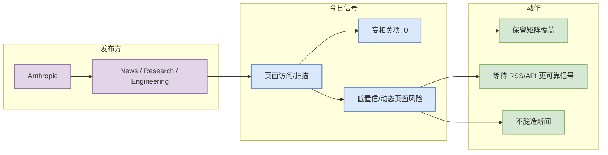

# Anthropic 来源扫描 - 2026-08-27

> 一句话结论：Anthropic 今日已纳入大厂资讯 / 工程博客 / Research 固定矩阵；未稳定解析到可进入必读区的新高相关项，状态为：已访问，未稳定解析到高相关新项。

## TL;DR

- 发布方/大厂：Anthropic
- 栏目/来源类型：News / Research / Engineering
- 原文链接：https://www.anthropic.com/news
- 今日状态：已访问，未稳定解析到高相关新项
- 高相关条数：0
- 代表条目：无高相关新项

## 信息压缩图示

## 专业解读

本页不是新闻正文，而是固定来源覆盖证明。今天没有把 Anthropic 的页面内容升级为必读项，原因是未稳定提取到与 LLM serving、training、post-training、agent eval、RL 或 world model 强相关的新发布。为避免误导，日报中标记为无高相关新项/低置信，而不是编造更新。

## 影响矩阵

| 方向 | 今日信号 | 动作 |
|---|---|---|
| AI Infra | 低置信 | 继续观察 |
| LLM / Agent | 低置信 | 等待可验证原文 |
| RL / Game AI | 无明确新项 | 跳过 |
| 来源可靠性 | 已访问，未稳定解析到高相关新项 | 后续可接 RSS/API |

## 相关链接

- 原文：https://www.anthropic.com/news
- 今日日报：[[Daily/2026-08-27]]

#ai-radar #industry #company-scan
