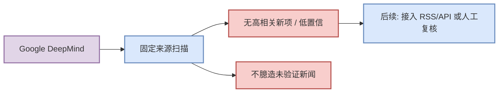

# Google DeepMind 固定来源扫描

> 类型：大厂资讯 / 来源扫描
> 发布方/大厂：Google DeepMind
> 栏目/来源类型：News / Research / Engineering Blog
> 创建日期：2026-08-28
> 原文链接：https://deepmind.google/discover/blog/
> 返回日报：[[Daily/2026-08-28]]

## 一句话结论
今日对 Google DeepMind 固定来源做覆盖扫描，未稳定确认 AI Infra / LLM / RL / Agent 强相关新项；以低置信记录保留 provenance。

## 信息压缩图示

## 元信息
| 字段 | 内容 |
|---|---|
| 发布方 | Google DeepMind |
| 来源类型 | News / Research / Engineering Blog |
| 今日状态 | 低置信/未发现高相关新项 |
| 原文 | [链接](https://deepmind.google/discover/blog/) |

## 专业解读
本条是日报固定矩阵的来源覆盖记录。对于大厂博客，宁可标注低置信或访问失败，也不把动态页面、营销页或未验证标题写成技术新闻。

## 对我的影响
| 维度 | 影响 | 建议动作 |
|---|---|---|
| AI Infra | 今日无稳定强信号 | 继续观察 |
| LLM / Agent | 不作为今日必读 | 等更可靠来源 |
| RL / Game AI | 无直接影响 | 跳过 |

## 相关链接
- 原文：https://deepmind.google/discover/blog/
- 网页详情：https://github.com/dyt27666-oss/AI-news-report-obsidians/blob/main/Industry/CompanyScans/2026-08-28/Google-DeepMind-source-scan.md

#ai-radar #industry #source-scan
