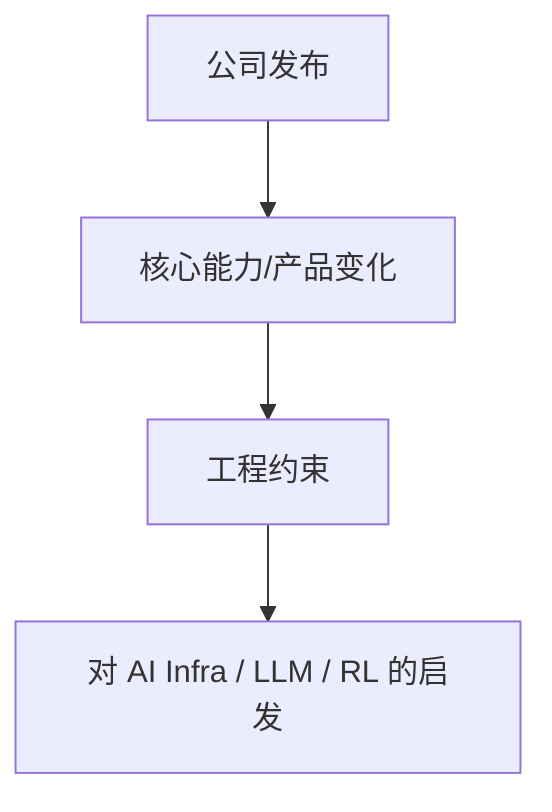

# We’re launching the Google DeepMind Accelerator program in Asia Pacific to tackle environmental risks

> 类型：大厂/工程博客
> 来源：Google DeepMind Blog
> 推荐等级：可 skim
> 原文链接：https://deepmind.google/blog/were-launching-the-google-deepmind-accelerator-program-in-asia-pacific-to-tackle-environmental-risks/

## 专业解读
这类博客的价值在于公司方向信号：哪些能力正在产品化，哪些 infra、安全、评估或 agent 需求正在变成正式流程。

## 通俗解释
它告诉我们大厂下一阶段可能往哪里投入。

## 图示

## 相关链接
- 原文：https://deepmind.google/blog/were-launching-the-google-deepmind-accelerator-program-in-asia-pacific-to-tackle-environmental-risks/

#ai-radar #industry
