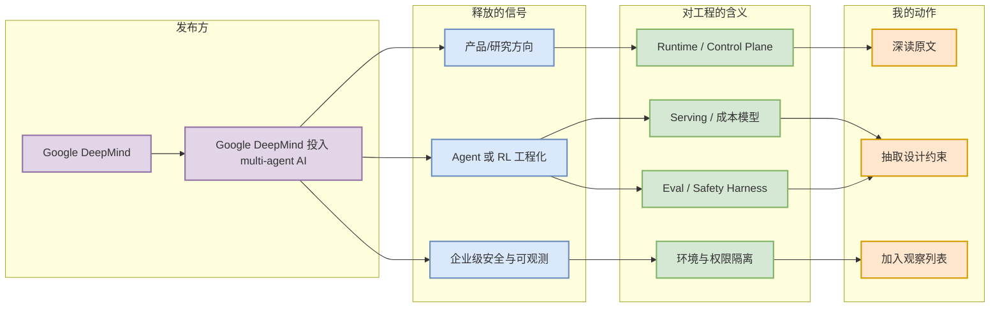
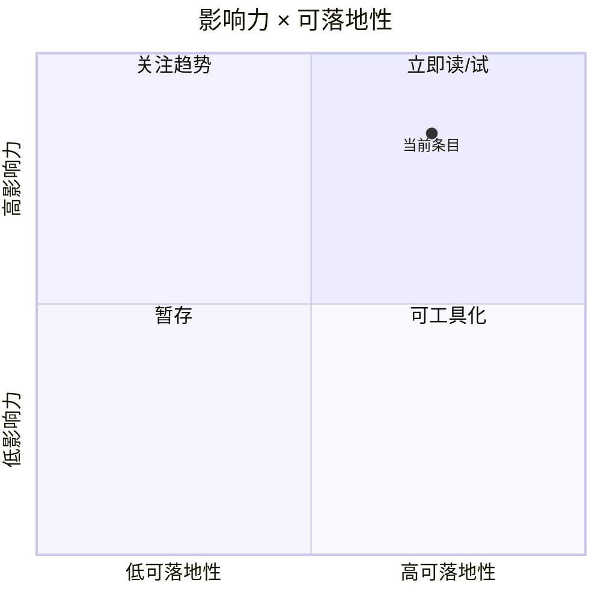

# Google DeepMind 投入 multi-agent AI safety research

> 类型：大厂资讯 / 工程博客
> 大类：博客
> 小类：Multi-agent Eval / Safety
> 推荐等级：必读
> 创建日期：2026-06-12
> 原文链接：https://deepmind.google/blog/investing-in-multi-agent-ai-safety-research/
> 网页详情：https://github.com/dyt27666-oss/AI-news-report-obsidians/blob/main/Industry/GoogleDeepMind/DeepMind_multi_agent_safety_research_2026_06_12.md
> 返回日报：[[Daily/2026-06-12]]

## 一句话结论

DeepMind 与合作方发起 multi-agent safety 研究资助，重点关注多智能体互动、协调、失控和评估问题。

## TL;DR

- **它是什么**：Google DeepMind 的 Research Blog / Funding Call 信号。
- **为什么重要**：多 agent 系统的风险不是单模型能力问题，而是策略互动、工具调用、资源竞争和长期任务可靠性问题；这会反向推动 agent eval、sandbox 与监控基础设施。
- **和我相关的点**：影响 agent runtime、serving/control plane、eval 或 RL 环境基础设施设计。
- **建议动作**：把 multi-agent eval/safety 加入 agent 平台评估清单，关注可观测性、博弈行为和环境隔离。

## 元信息

| 字段 | 内容 |
|---|---|
| 发布方/来源 | Google DeepMind |
| 大厂/实验室 | Google DeepMind |
| 栏目/来源类型 | Research Blog / Funding Call |
| 作者/机构 | Google DeepMind |
| 发布时间 | 2026-06-10 |
| 原文 | [原文](https://deepmind.google/blog/investing-in-multi-agent-ai-safety-research/) |
| 代码 | 未发现 |
| PDF | 无 |
| 标签 | #ai-radar #industry |

## 信息压缩图示

## 专业解读

多 agent 系统的风险不是单模型能力问题，而是策略互动、工具调用、资源竞争和长期任务可靠性问题；这会反向推动 agent eval、sandbox 与监控基础设施。 从 AI Infra 视角看，重点不在公告措辞，而在它暴露的系统边界：谁负责状态、任务如何恢复、权限如何审计、模型调用如何被路由，以及评测信号如何回流到产品迭代。若这些能力成为大厂默认配置，开源 agent/RL 平台也需要补齐 runtime、环境、日志、评测和成本控制。

## 通俗解释

可以把它理解为：大厂不再只发布模型，而是在把“模型如何长期、安全、可控地完成任务”做成平台能力。

## 关键机制拆解

| 机制 | 解决的问题 | 为什么有效 | 可能的坑 |
|---|---|---|---|
| 持久任务环境 | 长任务中断、上下文丢失 | 把 agent 状态从聊天窗口移到 runtime | 权限、成本和隔离复杂 |
| 工程化评测 | 多 agent/工具任务难评估 | 让失败可复现、可归因 | benchmark 可能脱离真实任务 |
| 控制面整合 | 模型、工具、数据分散 | 统一审计、调度和策略 | 平台锁定和黑盒风险 |

## 对我的影响

| 维度 | 影响 | 建议动作 |
|---|---|---|
| AI Infra | 需要关注 agent runtime 的状态、权限和调度 | 抽取可复用架构约束 |
| LLM 工程 | serving 从单请求转为长会话任务 | 设计成本预算与失败恢复 |
| RL / Game AI | 环境标准化和多 agent eval 重要性上升 | 关注可并行 rollout 环境 |
| Agent / Eval | 评估必须覆盖长时可靠性 | 建立任务级回归集 |

## 可信度与局限性

- 证据强度：来自官方发布，可信度高。
- 局限性：公告通常不披露完整架构和量化指标。
- 潜在风险：产品路线可能变化，工程细节需要后续验证。

## 我应该如何跟进

1. 阅读原文并记录可复用系统约束。
2. 跟踪是否出现代码、API、benchmark 或技术报告。
3. 将相关指标加入 agent/RL infra 观察表。

## 相关链接

- 原文：https://deepmind.google/blog/investing-in-multi-agent-ai-safety-research/
- 网页详情：https://github.com/dyt27666-oss/AI-news-report-obsidians/blob/main/Industry/GoogleDeepMind/DeepMind_multi_agent_safety_research_2026_06_12.md
- 返回日报：[[Daily/2026-06-12]]

## 标签

#ai-radar #industry #google-deepmind
