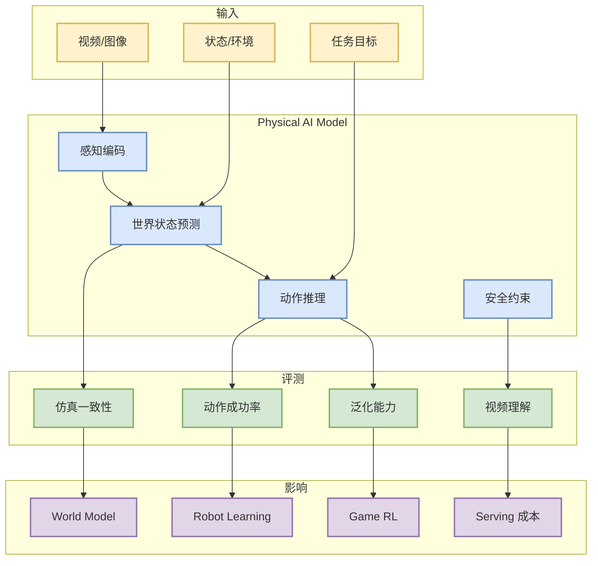
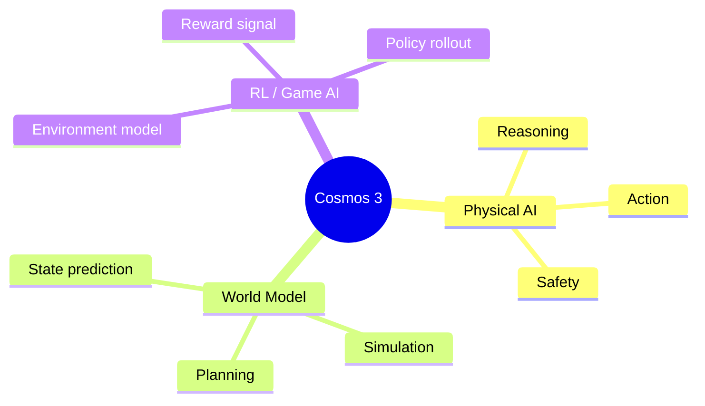

# Welcome NVIDIA Cosmos 3

> 类型：工程博客 / Physical AI  
> 大类：Industry  
> 小类：Hugging Face / NVIDIA  
> 推荐等级：后续深挖  
> 创建日期：2026-06-11  
> 原文链接：https://huggingface.co/blog/nvidia/cosmos-3-for-physical-ai  
> 返回日报：[[Daily/2026-06-11]]

## 一句话结论

Cosmos 3 指向 physical AI 中世界模型、感知和动作推理的融合，对 RL / Game AI / robot learning 有趋势价值。

## TL;DR

- **它是什么**：NVIDIA 在 Hugging Face 生态中发布的 physical AI reasoning and action 相关模型信号。
- **为什么重要**：world model 不再只是视频生成，而是逐渐连接环境理解、动作预测和机器人任务。
- **和我相关的点**：RL 游戏模型训练中的环境建模、仿真和动作策略可以借鉴 physical AI 的评测方式。
- **建议动作**：等待/检查模型卡、benchmark 和代码，先作为趋势观察。

## 元信息

| 字段 | 内容 |
|---|---|
| 发布方/来源 | Hugging Face Blog |
| 大厂/实验室 | NVIDIA / Hugging Face |
| 栏目/来源类型 | Model Release / Physical AI |
| 发布时间 | 2026-06 附近 |
| 原文 | [原文](https://huggingface.co/blog/nvidia/cosmos-3-for-physical-ai) |
| 标签 | #nvidia #world-model #physical-ai #rl |

## 信息压缩图示

## 专业解读

Cosmos 3 的高价值不在于本次是否能直接部署，而在于 NVIDIA 继续把 physical AI、视频/多模态模型、动作推理和世界模型绑定。对 RL 工程来说，这代表环境建模和动作评估会更依赖多模态基础模型；对 AI Infra 来说，视频和世界模型 serving 会带来更重的上下文、显存和吞吐压力。

## 通俗解释

它像是在让模型不只是“看懂视频”，还要理解物理世界接下来会怎样，并推断应该采取什么动作。

## 关键机制拆解

| 机制 | 解决的问题 | 为什么有效 | 可能的坑 |
|---|---|---|---|
| 世界状态预测 | 环境未来难建模 | 让策略具备前瞻性 | 幻觉会污染决策 |
| 动作推理 | 从理解到行动 | 连接感知与控制 | 评测复杂 |
| 多模态模型 | 统一视觉/语言/动作 | 降低模块边界 | serving 成本高 |

## 对我的影响

| 维度 | 影响 | 建议动作 |
|---|---|---|
| AI Infra | 多模态 serving 压力更大 | 关注显存、吞吐、视频 pipeline |
| LLM 工程 | VLM 与动作推理结合 | 观察模型卡和 API |
| RL / Game AI | world model 强相关 | 加入长期阅读清单 |
| Agent / Eval | embodied agent 评��复杂化 | 关注任务成功率和安全 |

## 可信度与局限性

- 证据强度：中；来自 HF/NVIDIA 公开博客标题与生态信号。
- 局限性：本次未完整读取模型卡和 benchmark。
- 还需要确认：权重开放程度、license、实验结果和代码。

## 我应该如何跟进

1. 查模型卡和 benchmark。
2. 对比 Genie、World Labs、Google DeepMind world model 方向。
3. 记录其对 RL 环境建模的可复用机制。

## 相关链接

- 原文：https://huggingface.co/blog/nvidia/cosmos-3-for-physical-ai
- 返回日报：[[Daily/2026-06-11]]

## 标签

#ai-radar #nvidia #world-model #physical-ai #rl
