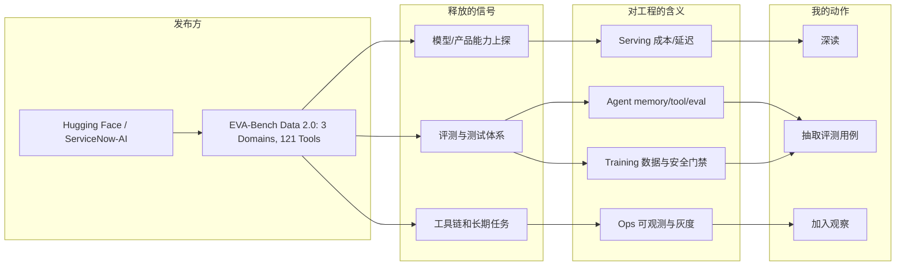
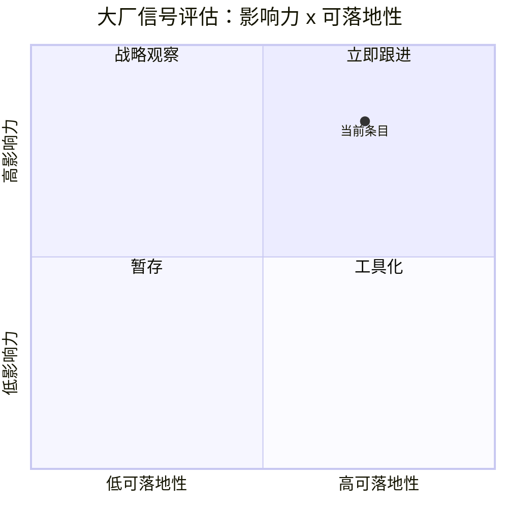

# EVA-Bench Data 2.0: 3 Domains, 121 Tools, 213 Scenarios

> 类型：大厂资讯 / 工程博客
> 大类：博客
> 小类：Hugging Face / ServiceNow-AI
> 推荐等级：必读
> 创建日期：2026-06-10
> 原文链接：https://huggingface.co/blog/ServiceNow-AI/eva-bench-data
> 网页详情：https://github.com/dyt27666-oss/AI-news-report-obsidians/blob/main/Industry/Hugging%20Face%20-%20ServiceNow-AI/2026-06-10-EVA-Bench-Data-2-0-3-Domains-121-Tools-213-Scenarios.md
> 返回日报：[[Daily/2026-06-10]]

## 一句话结论

EVA-Bench Data 2.0 扩展到多领域、多工具、多场景，强调 agent 工具使用评测。

## TL;DR

- **它是什么**：Hugging Face / ServiceNow-AI 的 Blog / Benchmark Dataset 信号。
- **为什么重要**：Agent eval 正在从问答分数转向工具链行为评估，适合纳入内部 agent 回归集。
- **和我相关的点**：训练/推理基础设施、agent evaluation、工具调用和上线质量门禁。
- **建议动作**：把信号转成内部 serving / agent harness 回归测试。

## 元信息

| 字段 | 内容 |
|---|---|
| 发布方/来源 | Hugging Face / ServiceNow-AI |
| 大厂/实验室 | Hugging Face / ServiceNow-AI |
| 栏目/来源类型 | Blog / Benchmark Dataset |
| 作者/机构 | Hugging Face / ServiceNow-AI |
| 发布时间 | 2026-06 |
| 原文 | [原文](https://huggingface.co/blog/ServiceNow-AI/eva-bench-data) |
| 代码 | 未发现 |
| PDF | 未发现 |
| 标签 | #ai-radar #industry #ai-infra #agent #eval |

## 信息压缩图示

## 专业解读

EVA-Bench Data 2.0 扩展到多领域、多工具、多场景，强调 agent 工具使用评测。 对基础设施侧的含义不是“又有新模型/新博客”，而是外部模型能力正在把系统瓶颈推向更长上下文、更长任务、更复杂工具链和更严格评测。LLM serving 需要关注会话状态、成本核算、cache 命中和回滚策略；agent 系统要关注工具失败、memory 污染、长任务可恢复性和 benchmark 是否覆盖真实链路。

## 通俗解释

未来用户会把更难、更长、更像工作的任务交给模型。如果基础设施只按一次问答设计，就会在状态、评测、成本和失败恢复上被放大打穿。

## 关键机制拆解

| 机制 | 解决的问题 | 为什么有效 | 可能的坑 |
|---|---|---|---|
| 长任务/高能力模型 | 专业工作负载 | 处理复杂链路 | 成本和失败恢复难度上升 |
| 评测数据扩展 | 上线质量不可控 | 用场景覆盖替代单分数 | benchmark 与真实任务偏移 |
| 工具链/记忆 | Agent 可持续执行 | 把上下文外化成系统状态 | memory 污染和工具错误累积 |

## 对我的影响

| 维度 | 影响 | 建议动作 |
|---|---|---|
| AI Infra | 需要状态管理、灰度和可观测 | 把长任务 trace 纳入 dashboard |
| LLM 工程 | 上下文、工具和成本成为一体问题 | 设计 per-task 成本和失败分类 |
| RL / Game AI | 长 horizon 评测可借鉴 agent eval | 用场景集替代单 episode 指标 |
| Agent / Eval | 真实链路评测更重要 | 建立 memory/tool 回归集 |

## 可信度与局限性

- 证据强度：中到高，来自官方页面扫描。
- 局限性：未做全文解析和社区复现验证。
- 潜在风险：官方公告天然偏正面。

## 我应该如何跟进

1. 深读原文，抽取可变成回归测试的场景。
2. 对照内部栈标记 memory、tool、cost 三类风险。
3. 一周后复查社区复现、benchmark 或 GitHub issue。

## 相关链接

- 原文：https://huggingface.co/blog/ServiceNow-AI/eva-bench-data
- 网页详情：https://github.com/dyt27666-oss/AI-news-report-obsidians/blob/main/Industry/Hugging%20Face%20-%20ServiceNow-AI/2026-06-10-EVA-Bench-Data-2-0-3-Domains-121-Tools-213-Scenarios.md
- 相关卡片：[[Daily/2026-06-10]]

## 标签

#ai-radar #industry #ai-infra #llm #agent #eval
