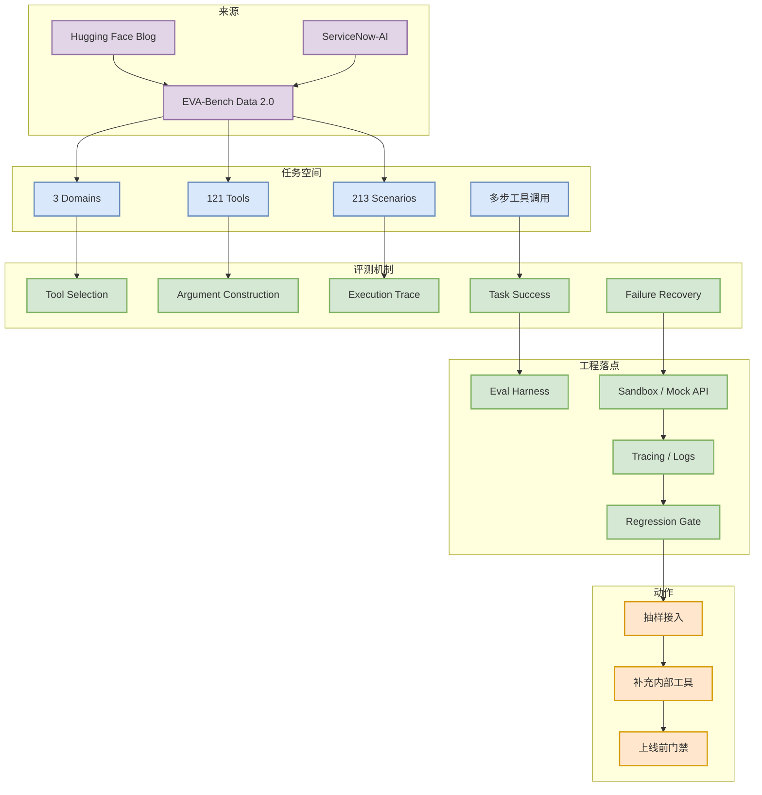
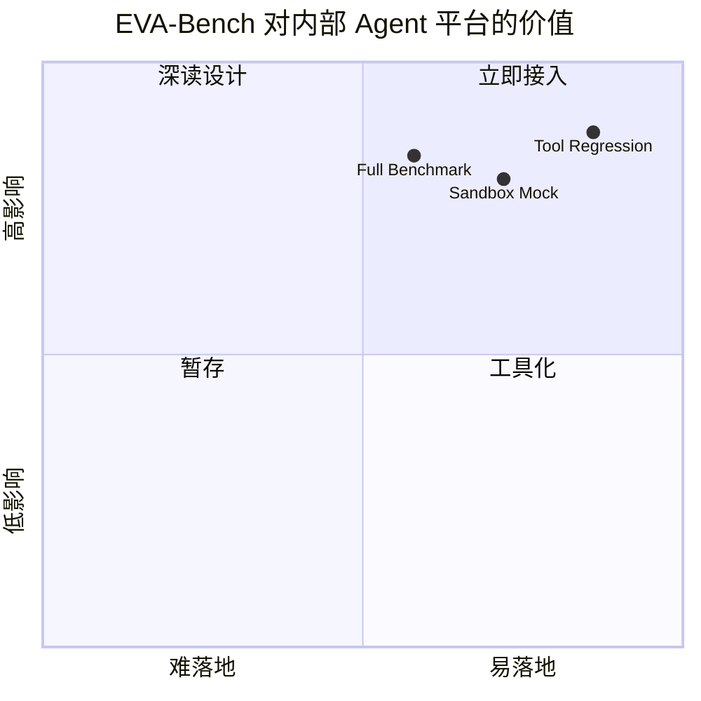

# EVA-Bench Data 2.0

> 类型：工程博客 / Benchmark Dataset  
> 大类：Industry  
> 小类：Hugging Face / ServiceNow-AI  
> 推荐等级：必读  
> 创建日期：2026-06-11  
> 原文链接：https://huggingface.co/blog/ServiceNow-AI/eva-bench-data  
> 网页详情：https://github.com/dyt27666-oss/AI-news-report-obsidians/blob/main/Industry/Hugging%20Face%20-%20ServiceNow-AI/2026-06-11-EVA-Bench-Data-2-0.md  
> 返回日报：[[Daily/2026-06-11]]

## 一句话结论

EVA-Bench Data 2.0 是今日最贴近 agent evaluation 工程落地的信号：它把评测从“模型会不会回答”推进到“模型能不能稳定使用工具完成任务”。

## TL;DR

- **它是什么**：ServiceNow-AI 在 Hugging Face 发布的 agent 工具使用评测数据，覆盖 3 个领域、121 个工具、213 个场景。
- **为什么重要**：Agent 的真实失败经常发生在工具选择、参数构造、状态恢复和多步计划，而不是最终自然语言回答。
- **和我相关的点**：可转成内部 agent regression suite，测试 tool calling、memory、API sandbox、错误恢复和日志观测。
- **建议动作**：下载数据结构，抽 20 个高价值场景接入现有 eval harness。

## 元信息

| 字段 | 内容 |
|---|---|
| 发布方/来源 | Hugging Face Blog |
| 大厂/实验室 | ServiceNow-AI / Hugging Face |
| 栏目/来源类型 | Blog / Benchmark Dataset / Agent Eval |
| 作者/机构 | ServiceNow-AI |
| 发布时间 | 2026-06 附近 |
| 原文 | [原文](https://huggingface.co/blog/ServiceNow-AI/eva-bench-data) |
| 代码 | 未确认 |
| PDF | 不适用 |
| 标签 | #agent-eval #tools #benchmark #llm |

## 信息压缩图示

### 主图：Agent Eval 数据流

### 辅助图：影响力 x 可落地性

## 专业解读

EVA-Bench 的关键价值是把 agent evaluation 从单轮问答转向工具行为轨迹。对工程系统而言，真正需要观测的是：模型是否选对工具、参数是否满足 schema、执行失败后是否能恢复、是否产生不必要调用，以及多步任务是否能在成本可控范围内完成。

这类数据集可以成为内部 agent 平台的回归门禁：每次改 prompt、tool schema、memory policy、model provider 或 planner，都可以���同一批场景检查回归。它也适合和 mock server / sandbox 结合，避免真实外部 API 成本和副作用。

## 通俗解释

传统考试问“你知道怎么做吗”，EVA-Bench 更像让模型真的去操作工具完成任务。对 agent 来说，这比只看答案更接近真实产品。

## 关键机制拆解

| 机制 | 解决的问题 | 为什么有效 | 可能的坑 |
|---|---|---|---|
| 多领域场景 | 防止只在单一任务上过拟合 | 覆盖更多工具语义和错误路径 | 领域仍可能与内部业务不一致 |
| 工具集合 | 测试 tool calling 能力 | 能暴露 schema、参数、调用顺序问题 | 工具定义质量会影响评测公平性 |
| 轨迹评估 | 看过程而非只看结果 | 便于定位 planner / executor / tool bug | 需要额外日志和 trace 基建 |

## 对我的影响

| 维度 | 影响 | 建议动作 |
|---|---|---|
| AI Infra | 需要 sandbox、mock API、trace、回归门禁 | 先做 20 个场景 PoC |
| LLM 工程 | function calling 和 planner prompt 可量化回归 | 加入模型切换评测 |
| RL / Game AI | 任务成功率可作为 reward 或 offline eval 信号 | 抽象为多步环境 |
| Agent / Eval | 直接高相关 | 设为本周深挖 |

## 可信度与局限性

- 证据强度：中高；来自 Hugging Face 官方博客和数据发布信号。
- 局限性：未在本次运行中下载数据全文验证 schema。
- 潜在风险：公开 benchmark 可能被过拟合，内部仍需私有场景。
- 还需要确认：license、数据格式、是否有 baseline、是否能离线跑。

## 我应该如何跟进

1. 打开原文并下载数据样例。
2. 抽取 20 个工具调用任务接入内部 eval harness。
3. 用 mock API 跑同一批任务，记录 trace、成本和失败类型。

## 相关链接

- 原文：https://huggingface.co/blog/ServiceNow-AI/eva-bench-data
- 返回日报：[[Daily/2026-06-11]]

## 标签

#ai-radar #agent-eval #benchmark #tools
