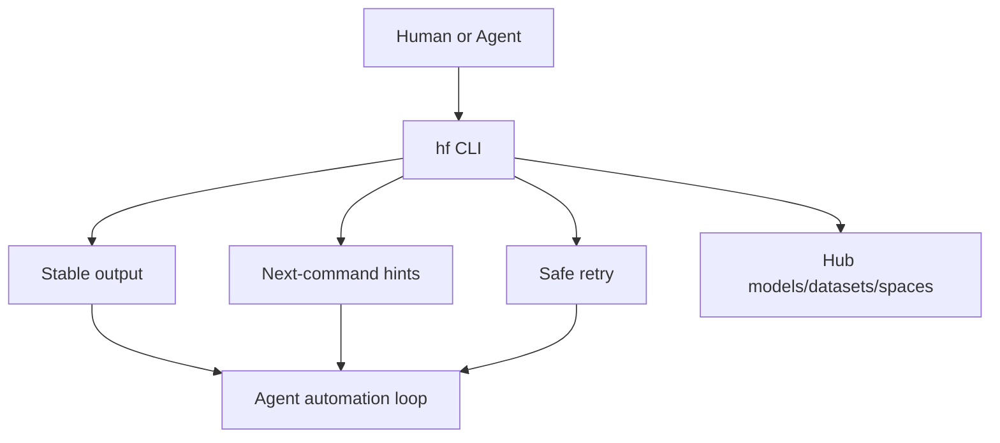

# Designing the hf CLI as an agent-optimized way to work with the Hub

> 类型：大厂博客/工程文章
> 分类：Industry / Hugging Face
> 推荐等级：必读
> 创建日期：2026-06-08
> 原文链接：https://huggingface.co/blog/hf-cli-for-agents

## 一句话结论

Hugging Face 正在把 hf CLI 设计成 Agent 友好的 Hub 操作接口，强调多渲染、下一步提示、可重试和非阻塞。

## 元信息

- 来源：Hugging Face
- 作者/机构：Célina Hanouti, Lucain Pouget Wauplin / Hugging Face
- 发布时间：2026-06-04
- 原文：https://huggingface.co/blog/hf-cli-for-agents
- 相关标签：agents, cli, infra, hub

## 专业解读

这篇文章的信号很强：基础设施 CLI 正在为 AI Agent 而不是只为人类交互优化。Agent 使用 CLI 的关键需求包括稳定输出格式、可机器解析、多命令 discoverability、幂等/安全重试、失败后 next-command hints。对内部平台来说，模型仓库、数据集、实验系统、部署系统的 CLI/API 都需要 agent-optimized contract。

## 通俗解释

以后很多工具不只是给人敲命令，也要给 Agent 自动调用。所以 CLI 要更像机器可理解的接口。

## 图示

## 核心要点

- AI agent traffic on the Hub 成为设计动机。
- 强调 humans and agents 共用同一命令。
- 输出渲染、下一步提示、非阻塞和安全重试是重点。

## 对我的影响

- AI Infra：内部 CLI 需要稳定 JSON 输出和幂等语义。
- LLM 工程：Agent 能更可靠地操作模型、数据集、Spaces。
- RL / Game AI：自动化训练 Agent 需要可脚本化、可恢复的工具接口。
- 建议动作：必读，整理内部 CLI agent-readiness checklist。

## 局限性 / 风险

- 文章偏工具设计，未给出通用标准；内部落地需要结合权限、审计、dry-run。
- Agent 友好不能牺牲人类可读性和误操作防护。

## 相关链接

- 原文：https://huggingface.co/blog/hf-cli-for-agents

## 标签

#ai-radar #industry #huggingface #cli #agents #infra
