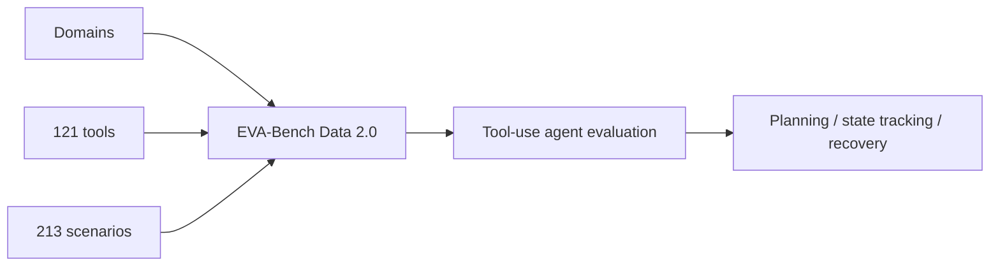

# EVA-Bench Data 2.0: 3 Domains, 121 Tools, 213 Scenarios

> 类型：大厂博客/工程文章
> 分类：Industry / ServiceNow AI / Hugging Face
> 推荐等级：可 skim
> 创建日期：2026-06-08
> 原文链接：https://huggingface.co/blog/ServiceNow-AI/eva-bench-data

## 一句话结论

EVA-Bench Data 2.0 扩展到 3 个领域、121 个工具、213 个场景，是工具使用 Agent 评测数据的重要补充。

## 元信息

- 来源：Hugging Face Blog
- 作者/机构：ServiceNow AI
- 发布时间：2026-06-04
- 原文：https://huggingface.co/blog/ServiceNow-AI/eva-bench-data
- 相关标签：agent-eval, tool-use, benchmark

## 专业解读

工具 Agent 的评测难点是场景、工具 schema、目标状态和验证标准都要可控。EVA-Bench Data 2.0 的价值在于扩大 domain/tool/scenario 覆盖，适合用于测试 tool selection、multi-step planning、error recovery 和 state tracking。结合今日多篇 Agent eval 污染论文，使用这类公开数据时要注意泄漏和过拟合。

## 通俗解释

它提供了更多让 Agent 调工具完成任务的考题，可以测试 Agent 是否真的会规划和用工具。

## 图示

## 核心要点

- 3 domains、121 tools、213 scenarios。
- 面向工具使用和企业 Agent 场景。
- 可作为 eval dataset 或 synthetic task seed。

## 对我的影响

- AI Infra：适合接入 Agent eval harness。
- LLM 工程：可用于测试 tool-calling 和 planner。
- RL / Game AI：多工具任务结构与游戏动作空间有相似性。
- 建议动作：可 skim，评估 license 和数据格式。

## 局限性 / 风险

- 公开 benchmark 可能被搜索时污染或训练污染。
- 企业场景与内部工具 schema 仍需适配。

## 相关链接

- 原文：https://huggingface.co/blog/ServiceNow-AI/eva-bench-data
- 相关卡片：[[Concepts/Agent Evaluation Contamination]]

## 标签

#ai-radar #industry #huggingface #agent-eval #tools
