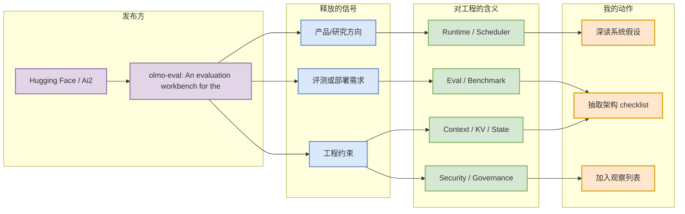
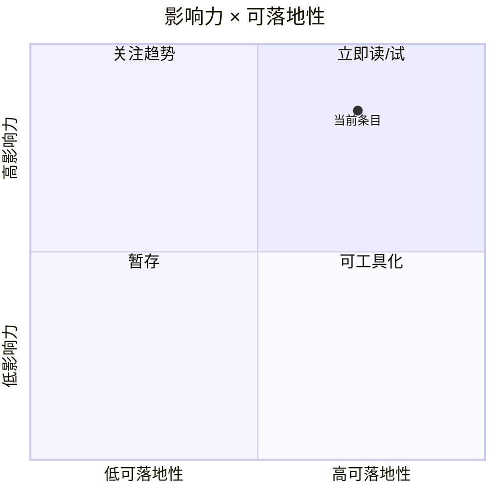

# olmo-eval: An evaluation workbench for the model development loop

> 类型：大厂资讯 / 工程博客
> 大类：博客
> 小类：AI Infra / Agent / Eval / Serving
> 推荐等级：必读
> 创建日期：2026-06-13
> 原文链接：https://huggingface.co/blog/allenai/olmo-eval
> 网页详情：https://github.com/dyt27666-oss/AI-news-report-obsidians/blob/main/Industry/HuggingFace/HuggingFace_olmo_eval_model_development_loop_2026_06_13.md
> 返回日报：[[Daily/2026-06-13]]

## 一句话结论

Ai2 在 Hugging Face 介绍 olmo-eval，把模型开发循环中的评测、回归比较、任务集合和可复现实验组织为 workbench。

## TL;DR

- **它是什么**：Hugging Face / Ai2 的 Blog / Evaluation Workbench 信号，主题与 AI Infra、agent runtime、eval 或 serving 强相关。
- **为什么重要**：后训练和模型迭代最怕 benchmark 漂移与不可复现；工程上需要把 eval 当成 pipeline，而不是一次性脚本。
- **和我相关的点**：它暴露了生产级 LLM/agent 系统里真正要优化的接口：runtime、调度、评测、权限、成本和可靠性。
- **建议动作**：阅读原文的系统约束部分；如果涉及工具或 benchmark，加入后续试用清单。

## 元信息

| 字段 | 内容 |
|---|---|
| 发布方/来源 | Hugging Face / Ai2 |
| 大厂/实验室 | Hugging Face / Ai2 |
| 栏目/来源类型 | Blog / Evaluation Workbench |
| 作者/机构 | Hugging Face / Ai2 |
| 发布时间 | 2026-06-12 |
| 原文 | [原文](https://huggingface.co/blog/allenai/olmo-eval) |
| 代码 | 未发现 |
| PDF | 未发现 |
| 标签 | #ai-infra #agent #serving #eval |

## 信息压缩图示

### 辅助图：影响力 × 可落地性

## 专业解读

后训练和模型迭代最怕 benchmark 漂移与不可复现；工程上需要把 eval 当成 pipeline，而不是一次性脚本。 这类信息的价值不在公告本身，而在它给出的系统边界：哪些 workload 正在变重，哪些指标开始被标准化，哪些组件需要从实验脚本提升为平台能力。对 AI Infra 工程来说，应重点抽取三类约束：第一，模型推理是否需要长上下文、并发 agent step 或工具调用；第二，是否要求端到端 latency/cost/quality 共同优化；第三，是否涉及企业级权限、审计、回滚和可观测性。

## 通俗解释

可以把它理解成大厂在告诉外界：“AI 不再只是聊天框或单模型 API，而是要进到真实软件流程、企业系统和基础设施里。”一旦进入这些场景，最难的往往不是让模型回答一次，而是让它可靠、便宜、可追踪地连续工作很多步。

## 关键机制拆解

| 机制 | 解决的问题 | 为什么有效 | 可能的坑 |
|---|---|---|---|
| 端到端 workload 定义 | 单 token 指标无法解释 agent 性能 | 把模型、工具、状态和反馈纳入同一闭环 | 容易被 benchmark gaming |
| 平台化 runtime | 长任务和多轮交互需要状态 | 可复用调度、权限和日志能力 | 初期复杂度高 |
| 评测/治理前置 | 企业或安全场景不可只看 demo | 让回归、审计、失败归因可执行 | 评测集可能与真实流量偏离 |

## 对我的影响

| 维度 | 影响 | 建议动作 |
|---|---|---|
| AI Infra | 关注 runtime、scheduler、缓存和控制面 | 提炼架构 checklist |
| LLM 工程 | 关注长上下文、成本、质量回归 | 对比现有 serving 指标 |
| RL / Game AI | 关注多步闭环和环境反馈 | 借鉴 agent workflow 评测 |
| Agent / Eval | 关注 harness、权限和任务成功率 | 加入内部 eval backlog |

## 可信度与局限性

- 证据强度：大厂官方信息，可信度高；但具体实现细节可能被抽象化。
- 局限性：公告/博客通常强调成功路径，较少披露失败案例和真实成本。
- 还需要确认：是否有公开代码、benchmark 配置、部署参数和复现实验。

## 我应该如何跟进

1. 阅读原文并摘出 workload、指标、系统组件。
2. 如果有工具或 benchmark，评估能否用现有 GPU/K8s/agent harness 复现。
3. 将相关约束映射到内部 serving、post-training 或 agent eval checklist。

## 相关链接

- 原文：https://huggingface.co/blog/allenai/olmo-eval
- 网页详情：https://github.com/dyt27666-oss/AI-news-report-obsidians/blob/main/Industry/HuggingFace/HuggingFace_olmo_eval_model_development_loop_2026_06_13.md
- 相关卡片：[[Daily/2026-06-13]]

## 标签

#ai-radar #industry #ai-infra #agent #eval
