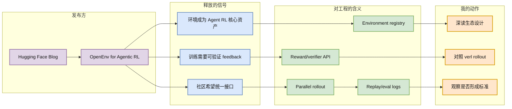

# The Open Source Community is backing OpenEnv for Agentic RL

> 类型：博客
> 大类：博客
> 小类：Agentic RL / Environments
> 推荐等级：必读
> 创建日期：2026-06-09
> 原文链接：https://huggingface.co/blog/openenv-agentic-rl
> 网页详情：https://github.com/dyt27666-oss/AI-news-report-obsidians/blob/main/Industry/HuggingFace/OpenEnv%20Agentic%20RL%20Community%20Signal.md
> 返回日报：[[Daily/2026-06-09]]

## 一句话结论

Hugging Face 上 OpenEnv 的社区信号说明 Agentic RL 的竞争焦点正在从单个模型/算法，转向可复用、可验证、可并行的环境基础设施。

## TL;DR

- **它是什么**：Hugging Face Blog 发布的 Agentic RL / OpenEnv 社区动态。
- **为什么重要**：后训练 Agent 需要大量可控环境、工具调用日志、reward 与重置机制，环境层会像 serving 层一样成为基础设施。
- **和我相关的点**：RL 游戏模型训练和 LLM Agent 训练都依赖环境并行、可验证 reward、任务分布和 replay 数据。
- **建议动作**：把 OpenEnv 与现有 Agent benchmark、verl/OpenRLHF rollout、内部游戏环境接口做对照。

## 元信息

| 字段 | 内容 |
|---|---|
| 发布方/来源 | Hugging Face Blog |
| 大厂/实验室 | Hugging Face / Open Source Community |
| 栏目/来源类型 | Blog / Community announcement |
| 作者/机构 | Hugging Face 社区文章 |
| 发布时间 | 2026-06-08 |
| 原文 | [原文](https://huggingface.co/blog/openenv-agentic-rl) |
| 代码 | 未在 RSS 元数据中确认 |
| PDF | 不适用 |
| 标签 | #agentic-rl #environment #huggingface |

## 信息压缩图示

### 影响矩阵

| 方向 | 影响 | 需要验证 |
|---|---|---|
| Agent RL | 训练不再只是算法，环境接口和验证器同等重要 | OpenEnv 是否有稳定 API 与任务覆盖 |
| Game AI | 环境并行、reset、reward shaping 可直接迁移 | 是否支持复杂模拟器和长 episode |
| LLM Infra | rollout service 可能成为 post-training 平台核心组件 | 与 Ray/vLLM/SGLang/verl 的集成路径 |

## 专业解读

Agentic RL 的长期瓶颈不是“能不能跑一次 GRPO”，而是环境是否可扩展、可重置、可评分、可审计。OpenEnv 这类信号值得关注，是因为它把开源社区注意力导向环境层：任务定义、工具权限、reward/verifier、状态快照和并行 rollout。对用户来说，这比单个 leaderboard 更重要；如果环境接口被标准化，训练 Agent、游戏 RL 和评测 Agent 的数据生产成本会显著下降。

## 通俗解释

训练 Agent 不只是给模型题目，还要给它一个可以反复试错的世界。OpenEnv 类项目就是想把这些“世界”做成可复用的训练场。

## 关键机制拆解

| 机制 | 解决的问题 | 为什么有效 | 可能的坑 |
|---|---|---|---|
| 环境注册 | 任务和环境分散 | 统一发现与复用 | 标准过早可能限制复杂任务 |
| 可验证 reward | Agent 容易钻漏洞 | 让结果可自动判定 | verifier 设计本身会被 overfit |
| 并行 rollout | 训练吞吐不足 | 环境层横向扩展 | 状态隔离和资源成本高 |

## 对我的影响

| 维度 | 影响 | 建议动作 |
|---|---|---|
| AI Infra | 环境服务可能成为后训练平台新控制面 | 设计 env API / verifier API 草案 |
| LLM 工程 | Agent 训练数据从 prompt 扩展到交互轨迹 | 关注 trajectory schema |
| RL / Game AI | 与游戏模拟器、世界模型训练高度相关 | 试做小型环境适配 |
| Agent / Eval | 评测和训练可共享环境，但要防污染 | 做 train/eval split 与日志审计 |

## 可信度与局限性

- 证据强度：来自 Hugging Face 官方博客 RSS，可确认发布时间和标题；正文细节需后续深读。
- 局限性：社区倡议不等于事实标准，生态成熟度仍需验证。
- 潜在风险：环境标准化后可能出现 benchmark overfitting。

## 我应该如何跟进

1. 阅读 OpenEnv 具体接口和示例环境。
2. 对照 verl / OpenRLHF 的 rollout worker 需求，列出适配点。
3. 观察是否有高质量 game / browser / desktop / tool-use 环境加入。

## 相关链接

- 原文：https://huggingface.co/blog/openenv-agentic-rl
- 网页详情：https://github.com/dyt27666-oss/AI-news-report-obsidians/blob/main/Industry/HuggingFace/OpenEnv%20Agentic%20RL%20Community%20Signal.md
- 相关卡片：[[GitHub/RL/verl HybridFlow RL Post-Training Framework]]、[[Papers/Agents/ADWM Off-Policy Evaluation of LLM Agents]]

## 标签

#ai-radar #blog #huggingface #agentic-rl #environment
