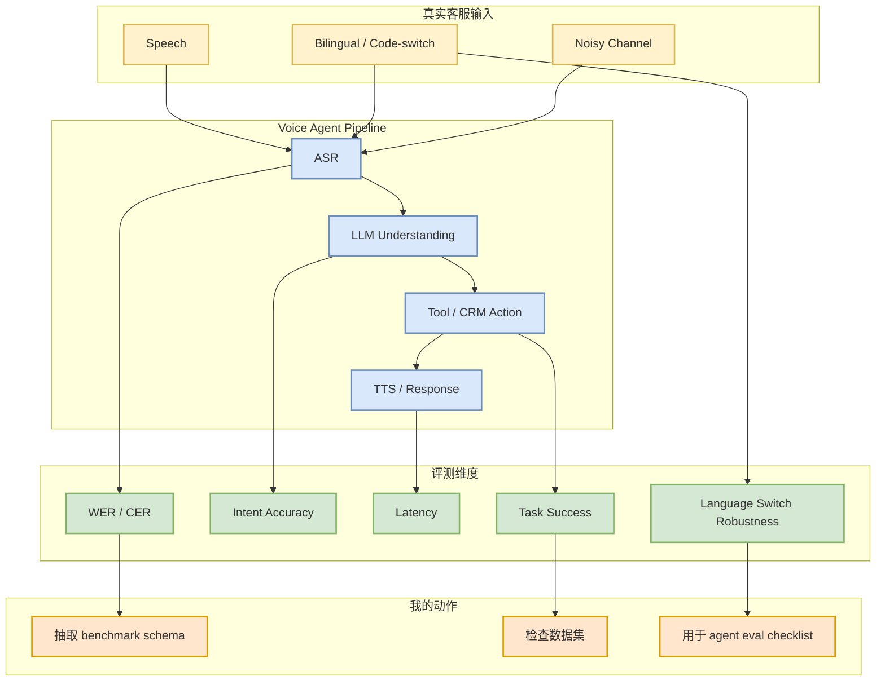
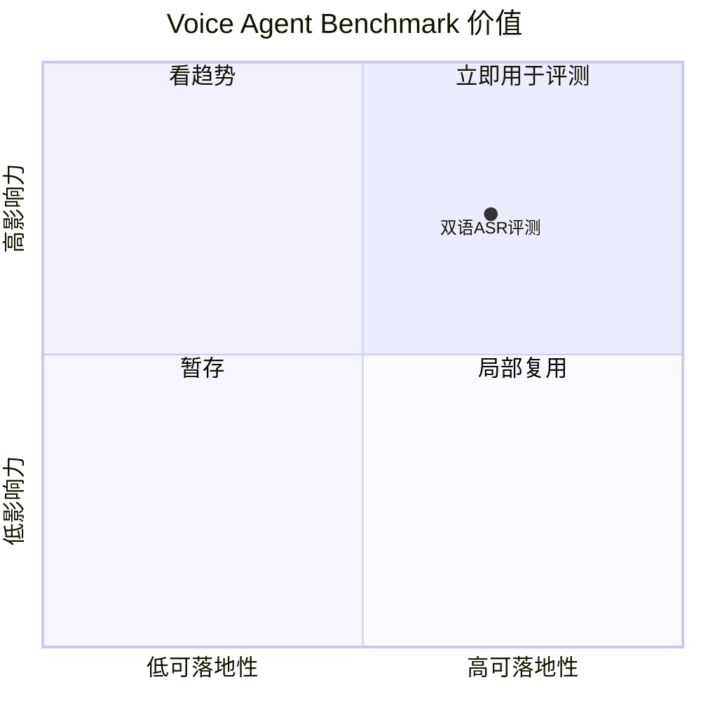

# Hugging Face: Can Voice Agents Handle Bilingual Customers?

> 类型：大厂博客
> 大类：大厂资讯 / 工程博客 / Research
> 小类：Blog / Benchmark
> 推荐等级：可 skim
> 创建日期：2026-06-14
> 原文链接：https://huggingface.co/blog
> 网页详情：https://github.com/dyt27666-oss/AI-news-report-obsidians/blob/main/Industry/HuggingFace/Voice-agents-bilingual-asr-benchmark.md
> 返回日报：[[Daily/2026-06-14]]

## 一句话结论

Hugging Face 把双语客服 voice agent 的 ASR benchmark 放在近期博客显著位置，说明 agent eval 正在从纯文本扩展到真实语音交互边界条件。

## TL;DR

- **它是什么**：关于 voice agents 是否能处理 bilingual / code-switched customer 的 benchmark 文章。
- **为什么重要**：语音 agent 的失败点包括 ASR、turn-taking、延迟、语言切换和工具调用，不是单一 LLM benchmark 能覆盖。
- **和我相关的点**：对 agent evaluation、生产环境鲁棒性和多模态 serving 有参考价值。
- **建议动作**：后续补读原文，抽取评测指标和数据集构造方式。

## 元信息

| 字段 | 内容 |
|---|---|
| 发布方/来源 | Hugging Face |
| 大厂/实验室 | Hugging Face |
| 栏目/来源类型 | Blog / Benchmark |
| 作者/机构 | ServiceNow-AI / Hugging Face Blog 列表显示 |
| 发布时间 | Blog 列表显示约 4 days ago，具体日期需打开原文确认 |
| 原文 | [原文](https://huggingface.co/blog) |
| 代码 | 未发现 |
| PDF | 未发现 |
| 标签 | #huggingface #voice-agent #eval #asr |

## 信息压缩图示

## 专业解读

文本 agent benchmark 容易忽略输入层错误，而 voice agent 的真实质量取决于端到端链路：ASR 识别错会传导到 intent、tool call 和 response。双语/语言切换场景进一步放大鲁棒性问题，因此这类 benchmark 对生产 agent 更有现实意义。

## 通俗解释

如果客服一句话中中英混杂，AI 不仅要听懂，还要知道用户要办什么事、调用正确工具、及时回答；任何一步错都会让体验崩掉。

## 关键机制拆解

| 机制 | 解决的问题 | 为什么有效 | 可能的坑 |
|---|---|---|---|
| ASR benchmark | 语音识别质量不可见 | 量化输入层错误 | WER 不等于任务成功 |
| Code-switch test | 单语测试过于理想 | 覆盖真实语言混用 | 数据集难构造 |
| End-to-end metric | 局部指标割裂 | 观察最终任务成功 | attribution 较难 |

## 对我的影响

| 维度 | 影响 | 建议动作 |
|---|---|---|
| AI Infra | 多模态 serving 需要监控链路 | 记录 ASR/LLM/TTS latency |
| LLM 工程 | 输入噪声影响工具调用 | 加入噪声与多语测试 |
| RL / Game AI | 语音/多模态交互可类比环境噪声 | 关注鲁棒 reward |
| Agent / Eval | 强相关 | 抽取评测 checklist |

## 可信度与局限性

- 证据强度：来自 Hugging Face Blog 列表抓取。
- 局限性：尚未读取正文，指标细节待确认。
- 风险：不同语言组合和行业场景差异大。

## 我应该如何跟进

1. 打开原文，记录 benchmark 数据集和指标。
2. 判断是否有开源评测代码或模型列表。
3. 把 voice agent end-to-end 指标加入 agent eval 观察清单。

## 相关链接

- 原文：https://huggingface.co/blog
- 网页详情：https://github.com/dyt27666-oss/AI-news-report-obsidians/blob/main/Industry/HuggingFace/Voice-agents-bilingual-asr-benchmark.md
- 相关卡片：[[Daily/2026-06-14]]

## 标签

#ai-radar #huggingface #voice-agent #eval #asr
