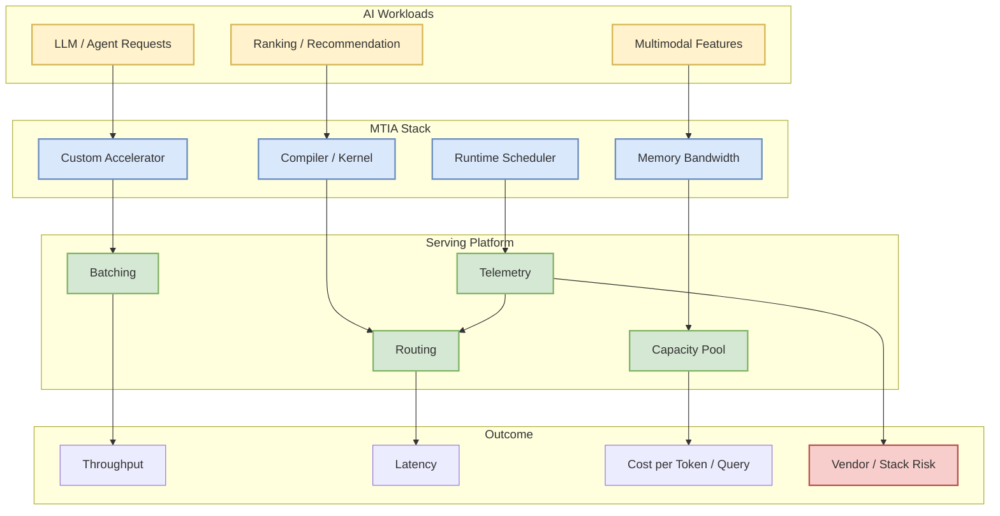

# Four MTIA Chips in Two Years

> 类型：工程博客  
> 大类：Industry  
> 小类：Meta AI / AI Chips  
> 推荐等级：必读  
> 创建日期：2026-06-11  
> 原文链接：https://ai.meta.com/blog/meta-mtia-scale-ai-chips-for-billions/  
> 网页详情：https://github.com/dyt27666-oss/AI-news-report-obsidians/blob/main/Industry/Meta%20AI/2026-06-11-Four-MTIA-Chips-in-Two-Years.md  
> 返回日报：[[Daily/2026-06-11]]

## 一句话结论

Meta 两年四代 MTIA 的信号说明，大规模 AI 推理优化正在从“软件框架调优”升级为“模型、编译器、调度、芯片、容量规划”的全栈协同。

## TL;DR

- **它是什么**：Meta AI 关于 MTIA AI 芯片迭代和规模化 AI 体验的工程博客。
- **为什么重要**：高并发 LLM/推荐/多模态服务的单位成本，会越来越受硬件栈和调度策略影响。
- **和我相关的点**：推理平台设计需要兼容异构加速器、kernel 差异、容量池和成本模型。
- **建议动作**：把 MTIA 作为“自研推理芯片趋势”观察项，对比 NVIDIA GPU、TPU、Trainium/Inferentia。

## 元信息

| 字段 | 内容 |
|---|---|
| 发布方/来源 | Meta AI Blog |
| 大厂/实验室 | Meta AI |
| 栏目/来源类型 | Engineering Blog / AI Chips |
| 作者/机构 | Meta AI |
| 发布时间 | 2026-06 附近 |
| 原文 | [原文](https://ai.meta.com/blog/meta-mtia-scale-ai-chips-for-billions/) |
| 代码 | 未发现 |
| PDF | 不适用 |
| 标签 | #meta-ai #ai-infra #inference #hardware |

## 信息压缩图示

### 主图：推理硬件到服务成本

### 辅助图：硬件选择影响矩阵

| 维度 | GPU 池 | 自研推理芯片 | 对平台的要求 |
|---|---|---|---|
| 弹性 | 通用性高 | 需要 workload 匹配 | 路由和容量池更复杂 |
| 性能 | 生态成熟 | 对特定模型可能更优 | kernel / compiler 更关键 |
| 成本 | 市场供给影响大 | 长期成本可控 | 需要规模化摊销 |
| 风险 | 供应链和价格 | 生态锁定 | 观测和回退必须完善 |

## 专业解读

这条博客对 AI Infra 的价值在于提醒我们：当模型调用规模达到数十亿用户级，单纯靠 vLLM/SGLang、batching 或 quantization 已经不足以解释成本结构。芯片、编译器、runtime、容量池和业务负载分布会共同决定真实吞吐和延迟。

对服务平台来说，关键问题会变成：哪些模型适合放到专用加速器，哪些保留在通用 GPU；如何在多硬件池之间路由；如何处理 kernel 差异；如何把成本指标接入调度器。

## 通俗解释

这类似于从“买更快的车”变成“自己修路、造车、管交通”。大厂为了让 AI 服务便宜且稳定，开始把硬件和软件一起设计。

## 关键机制拆解

| 机制 | 解决的问题 | 为什么有效 | 可能的坑 |
|---|---|---|---|
| 自研加速器 | 降低大规模推理成本 | 对固定 workload 可深度优化 | 通用性和生态不如 GPU |
| Runtime 调度 | 匹配请求和硬件池 | 提升利用率 | 调度逻辑更复杂 |
| 编译器/kernel | 挖掘硬件性能 | 可降低延迟和成本 | 需要长期维护 |

## 对我的影响

| 维度 | 影响 | 建议动作 |
|---|---|---|
| AI Infra | 异构硬件调度重要性上升 | 关注硬件抽象和成本指标 |
| LLM 工程 | 模型结构会受硬件特性影响 | 观察 MoE、长上下文、KV cache 适配 |
| RL / Game AI | 大规模仿真/推理也受硬件池影响 | 关注环境并行成本 |
| Agent / Eval | 长任务 agent 成本更依赖硬件效率 | 记录 token/query 成本 |

## 可信度与局限性

- 证据强度：中高；来自 Meta 官方工程博客。
- 局限性：公开博客通常不披露完整性能和内部约束。
- 潜在风险：不能直接外推到非 Meta 业务规模。
- 还需要确认：芯片架构细节、支持模型类型、编译器生态和真实成本数据。

## 我应该如何跟进

1. 查找 MTIA 公开架构资料和性能指标。
2. 对比 NVIDIA GPU、TPU、Inferentia/Trainium 的推理定位。
3. 在内部 serving 设计中保留异构硬件路由和成本观测接口。

## 相关链接

- 原文：https://ai.meta.com/blog/meta-mtia-scale-ai-chips-for-billions/
- 返回日报：[[Daily/2026-06-11]]

## 标签

#ai-radar #meta-ai #inference #hardware #ai-infra
